# 🔐 PortSwigger Lab: CSRF Vulnerability with No Defenses

## 🧪 Lab Overview

**Lab Name:** CSRF vulnerability with no defenses  
**Difficulty:** Apprentice  
**Status:** Solved  
**Vulnerability Type:** Cross-Site Request Forgery (CSRF)

This lab contains an email change functionality that is vulnerable to **Cross-Site Request Forgery (CSRF)**.

The objective of this lab was to craft HTML that performs a CSRF attack and changes the victim's email address. The malicious HTML is then delivered through the lab's exploit server.

The lab provided the following credentials:

```text
Username: wiener
Password: peter
```

The main issue was that the email change functionality accepted a state-changing request without implementing effective CSRF protection.

---

## 🧠 How I Approached the Problem

I started by accessing the lab and exploring the available functionality.

After opening the application, I noticed the **My account** option. Since the lab description specifically mentioned that the email change functionality was vulnerable to CSRF, I navigated to the account section.

The application required authentication, so I logged in using the provided credentials:

```text
Username: wiener
Password: peter
```

After successfully logging in, I was redirected to the **My Account** page.

The page displayed my current username and email address and provided an **Update email** functionality.

Before attempting the CSRF attack, I first tested the normal functionality by changing my own email address. This helped me understand how the application processed the email update request.

Next, I configured **FoxyProxy** to route browser traffic through Burp Suite.

After that, I enabled **Intercept** in Burp Suite and submitted another email change request.

Burp Suite captured the following request:

```http
POST /my-account/change-email HTTP/2
```

The request contained the email parameter:

```text
email=zozo%40gmail.com
```

I noticed that the request did not contain a visible CSRF token.

To further test and understand the request, I sent it to **Burp Repeater**.

After confirming that the request was responsible for changing the email address, I used Burp Suite's:

```text
Engagement tools → Generate CSRF PoC
```

Burp Suite generated HTML containing a form that submitted a request to the email change endpoint.

I enabled:

```text
Include auto-submit script
```

This allowed the generated form to automatically submit when opened.

I then modified the email value from:

```text
zozo@gmail.com
```

to:

```text
abc@gmail.com
```

Finally, I tested the generated CSRF proof of concept in the browser.

When the exploit was opened, the request was automatically submitted and changed the email address without requiring the user to manually click the **Update email** button.

This demonstrated that the application trusted the authenticated browser session and processed the state-changing request without verifying whether the request was intentionally initiated by the user.

The exploit successfully changed the email address, and the lab was marked as **Solved**.

---

# 📸 Screenshot-by-Screenshot Explanation

## Screenshot 1: Lab Description

This screenshot shows the details of the lab:

**CSRF vulnerability with no defenses**

The lab description explains that the application's email change functionality is vulnerable to CSRF.

The objective is to craft HTML that performs a CSRF attack to change the viewer's email address and upload the exploit to the exploit server.

The lab also provides the login credentials:

```text
Username: wiener
Password: peter
```


---

## Screenshot 2: Accessing the Lab

After clicking **Access the Lab**, the application's home page opened.

From here, I started exploring the available functionality to locate the email change feature mentioned in the lab description.


---

## Screenshot 3: Exploring the My Account Option

On the home page, I noticed the **My account** option.

Since the lab description mentioned the email change functionality, I clicked on **My account** to check whether account-related settings were available.

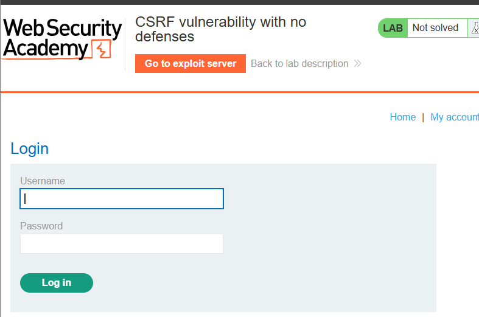

---

## Screenshot 4: Login Page

After clicking **My account**, the application redirected me to the login page.

The lab provided valid credentials, so I used them to access my account.


---

## Screenshot 5: Logging In

On the login page, I entered:

```text
Username: wiener
Password: peter
```

After entering the credentials, I clicked the **Log in** button.

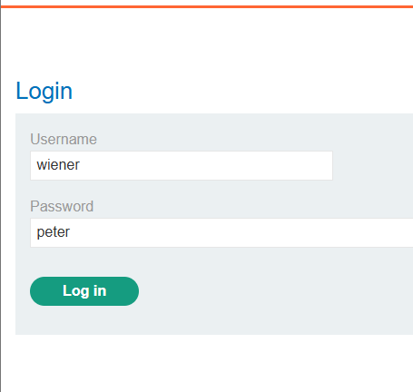

---

## Screenshot 6: My Account and Update Email Functionality

After successfully logging in, the **My Account** page opened.

The page displayed:

```text
Username: wiener
Email: wiener@normal-user.net
```

Below the account information, there was an input field and an **Update email** button.

This was the functionality mentioned in the lab description and became the main target for testing the CSRF vulnerability.

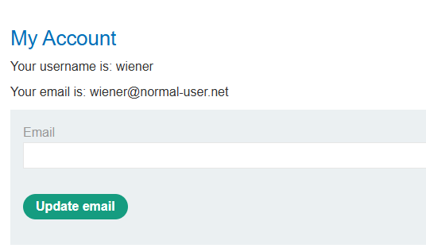

---

## Screenshot 7: Testing the Email Update Functionality

Before attempting the CSRF attack, I first tested the normal functionality.

I entered:

```text
xoxo@gmail.com
```

and clicked the **Update email** button.

The application successfully updated the email address.

This confirmed that the functionality was working and helped me understand the action that needed to be reproduced through a CSRF attack.

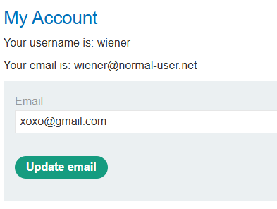

---

## Screenshot 8: Preparing to Capture the Request

After confirming that the email update functionality worked, I wanted to capture the HTTP request responsible for changing the email address.

For this, I used **Burp Suite**.

Capturing the request would allow me to inspect the HTTP method, target endpoint, request parameters, and possible security protections.

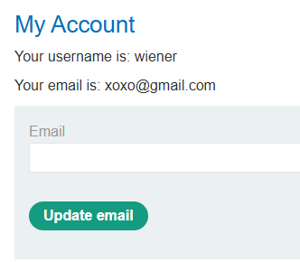

---

## Screenshot 9: Configuring FoxyProxy

Before capturing the request in Burp Suite, I clicked the **FoxyProxy** extension located in the top-right corner of the browser.

I selected the Burp Suite proxy configuration:

```text
burp
```

This routed the browser traffic through Burp Suite, allowing me to intercept and inspect the HTTP requests sent from the browser to the lab application.

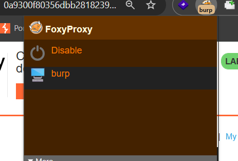

---

## Screenshot 10: Enabling Intercept in Burp Suite

I opened Burp Suite and navigated to:

```text
Proxy → Intercept
```

I enabled:

```text
Intercept on
```

This allowed Burp Suite to capture the next request sent from the browser.

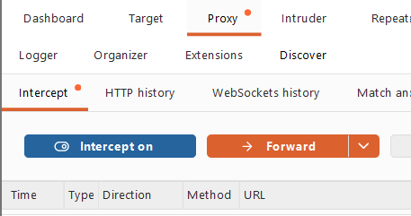

---

## Screenshot 11: Submitting Another Email Change Request

I returned to the **Update email** functionality.

This time, I entered:

```text
zozo@gmail.com
```

and clicked the **Update email** button.

Since Burp Suite interception was enabled, the request was captured before being sent to the server.

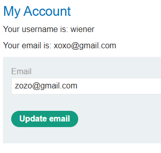

---

## Screenshot 12: Capturing and Inspecting the Request

Burp Suite captured the request responsible for changing the email.

The request used:

```http
POST /my-account/change-email
```

The request body contained:

```text
email=zozo%40gmail.com
```

The `%40` represents the `@` symbol in URL encoding.

I also checked the `Host` header to confirm that the request was being sent to the correct lab application.

While inspecting the request, I did not observe a CSRF token being included with the email change request.

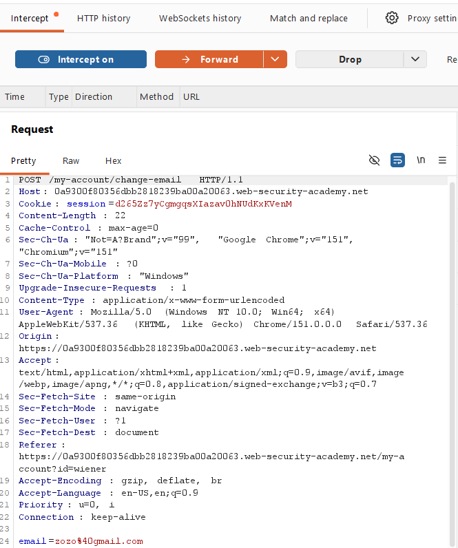

---

## Screenshot 13: Sending the Request to Repeater

To further inspect and test the request, I right-clicked on the captured request and selected:

```text
Send to Repeater
```

This allowed me to work with the request separately without depending on the browser workflow.

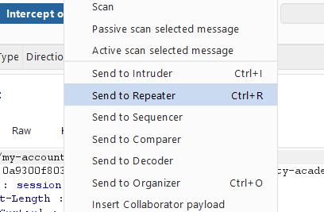

---

## Screenshot 14: Testing the Request in Burp Repeater

The request was successfully sent to the **Repeater** tab.

In Repeater, I could inspect the request and test how the server responded to the email change request.

The request confirmed that the email change functionality was triggered through:

```text
/my-account/change-email
```

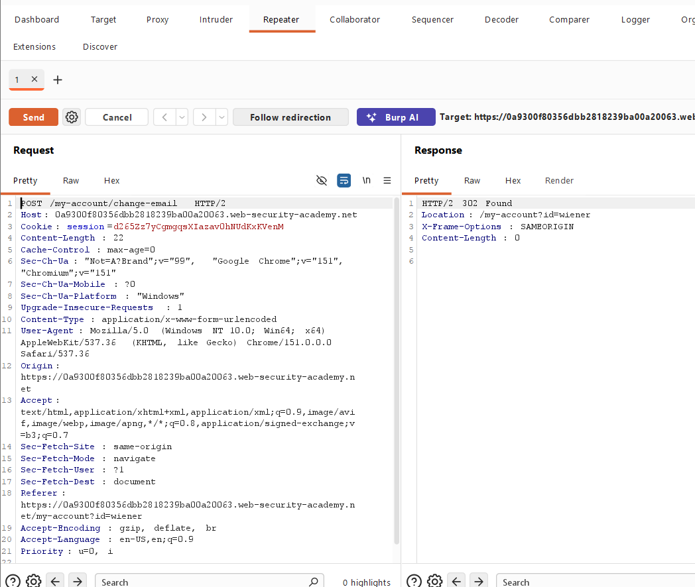

---

## Screenshot 15: Opening Generate CSRF PoC

After identifying the request, I right-clicked on it and selected:

```text
Engagement tools → Generate CSRF PoC
```

Burp Suite provides this feature to generate a proof-of-concept HTML page based on the selected HTTP request.

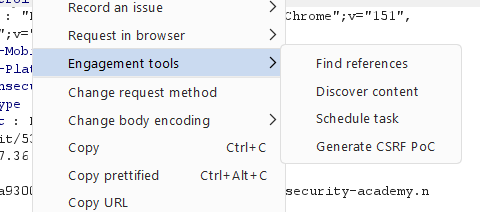

---

## Screenshot 16: Generated CSRF Proof of Concept

The **CSRF PoC Generator** opened.

Burp Suite generated HTML containing a form that reproduced the email change request.

The generated HTML contained the target endpoint and the email parameter.

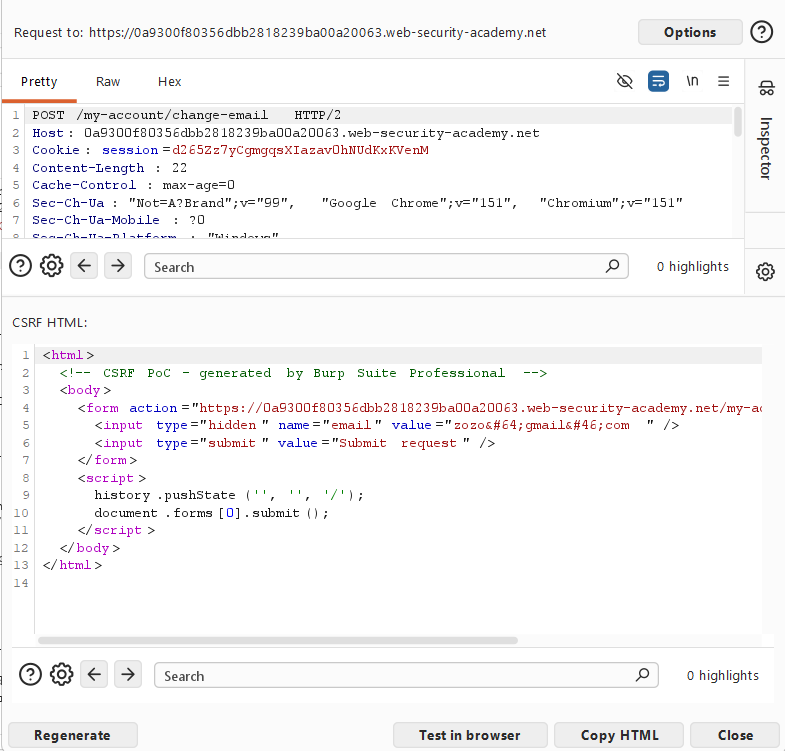

---

## Screenshot 17: Enabling Auto-Submit

In the CSRF PoC window, I clicked the **Options** button.

I selected:

```text
Include auto-submit script
```

This added JavaScript that automatically submits the form when the exploit page is opened.

The important part of the generated code was similar to:

```html
<script>
    document.forms[0].submit();
</script>
```

This means the form can submit automatically when opened.

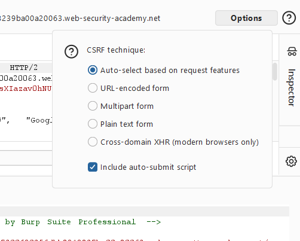

---

## Screenshot 18: Modifying the Email Value

The generated CSRF PoC initially contained:

```text
zozo@gmail.com
```

I changed this value to:

```text
abc@gmail.com
```

This demonstrated that the request could change the authenticated user's email address to a different value.

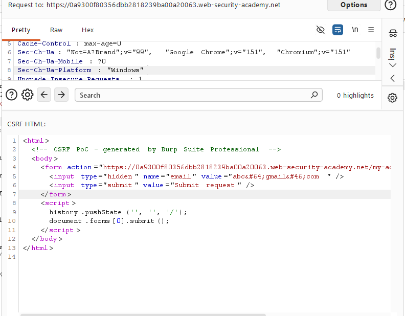

---

## Screenshot 19: Testing the Exploit in the Browser

After modifying the email address, I clicked:

```text
Test in browser
```

Burp Suite generated a URL for testing the CSRF proof of concept.

I opened the generated exploit URL in another browser tab.

Because the auto-submit option was enabled, the form automatically submitted the request.

The email address was changed to:

```text
abc@gmail.com
```

without manually using the application's **Update email** button.

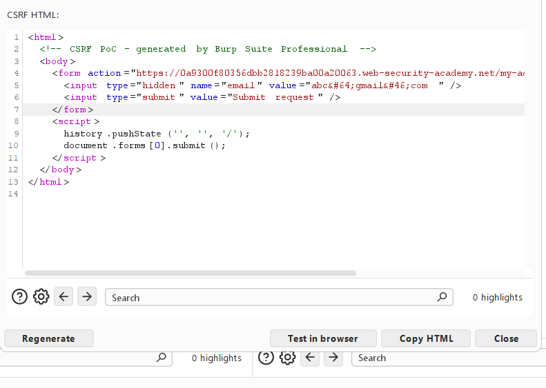

---

## Screenshot 20: Lab Successfully Solved

After the CSRF proof of concept successfully changed the email address, the lab displayed:

```text
LAB Solved
```

This confirmed that the application was vulnerable to CSRF because a state-changing request could be triggered through attacker-controlled HTML without effective CSRF protection.

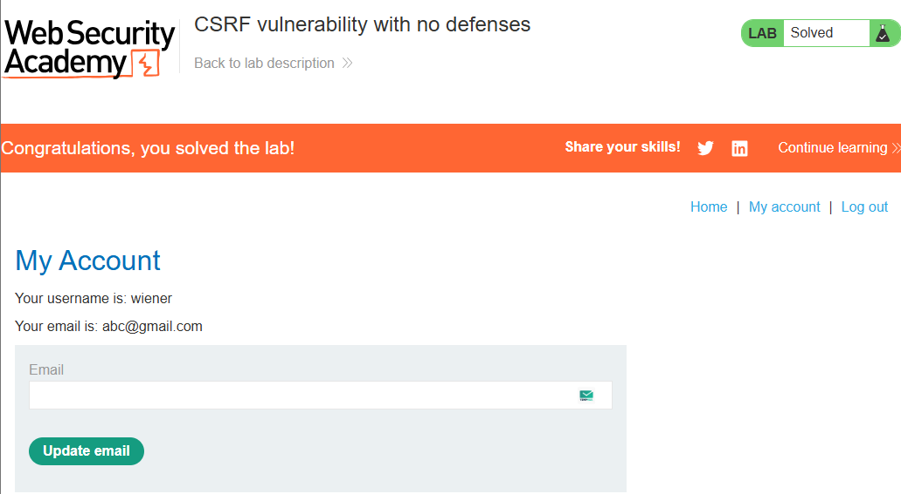

---

# 🔍 Different Possibilities I Considered

During this lab, I followed and considered several approaches:

- Exploring the application to locate the vulnerable functionality.
- Checking the **My account** section.
- Logging in using the provided credentials.
- Testing the normal email update functionality.
- Configuring FoxyProxy to route browser traffic through Burp Suite.
- Capturing the email change request using Burp Suite.
- Inspecting the HTTP method and request parameters.
- Checking whether a CSRF token was present.
- Sending the request to Burp Repeater for further testing.
- Generating a CSRF proof of concept using Burp Suite.
- Enabling automatic form submission.
- Modifying the email parameter.
- Testing whether opening the generated HTML automatically changed the email address.

The successful approach was generating an HTML form that reproduced the legitimate email change request.

---

# ⚡ How the Vulnerability Was Confirmed

The vulnerability was confirmed when I captured the email change request and observed that the application accepted a state-changing request containing the required email parameter.

The request was similar to:

```http
POST /my-account/change-email HTTP/2
```

with:

```text
email=abc%40gmail.com
```

A CSRF proof of concept was then generated:

```html
<form method="POST" action="https://TARGET-LAB-ID.web-security-academy.net/my-account/change-email">
    <input type="hidden" name="email" value="abc@gmail.com">
</form>

<script>
    document.forms[0].submit();
</script>
```

When the proof of concept was tested, the authenticated user's email address changed successfully.

This confirmed that the application accepted a cross-site request without effective protection against CSRF.

---

# 🎯 Root Cause

The root cause of the vulnerability was the absence of proper CSRF defenses on a state-changing functionality.

The application allowed the email address to be changed through:

```text
/my-account/change-email
```

The request did not require an anti-CSRF token or another effective mechanism to verify that the request was intentionally initiated by the legitimate user.

The application therefore failed to distinguish between:

```text
A legitimate request initiated by the user
```

and:

```text
A malicious request triggered from another website
```

---

# 🛡️ Remediation

## 1. Implement Anti-CSRF Tokens

Every state-changing request should include a unique and unpredictable CSRF token.

For example:

```html
<input type="hidden" name="csrf_token" value="RANDOM_UNPREDICTABLE_TOKEN">
```

The server should validate the token before processing the request.

## 2. Validate CSRF Tokens on the Server Side

The server must verify that the submitted token is valid and belongs to the authenticated user's session.

If the token is missing or invalid, the request should be rejected.

## 3. Use SameSite Cookie Attributes

Session cookies can use the `SameSite` attribute to reduce the risk of cookies being sent with cross-site requests.

For example:

```text
SameSite=Lax
```

or, where appropriate:

```text
SameSite=Strict
```

However, SameSite cookies should not be considered the only protection mechanism for sensitive actions.

## 4. Validate the Origin or Referer Header

For sensitive requests, the server can validate:

```text
Origin
```

and, where appropriate:

```text
Referer
```

The application can verify whether the request originated from a trusted domain.

## 5. Require Reauthentication for Sensitive Actions

For highly sensitive account changes, applications can require the user to confirm their password or reauthenticate before processing the action.

## 6. Protect All State-Changing Requests

CSRF protection should be implemented for actions such as:

- Changing email addresses
- Changing passwords
- Updating account details
- Deleting accounts
- Changing payment information
- Performing administrative actions

---

# 📚 Key Learning

Through this lab, I learned that:

- CSRF targets authenticated users.
- A request can be triggered without the user manually submitting the application's form.
- Browsers may automatically include authentication cookies with requests.
- State-changing functionality requires CSRF protection.
- POST requests are not automatically protected from CSRF.
- Burp Suite can be used to capture and analyze application requests.
- FoxyProxy can route browser traffic through Burp Suite.
- Burp Suite's **Generate CSRF PoC** feature can help demonstrate a CSRF vulnerability.
- Auto-submitting forms can automatically trigger vulnerable actions.
- The absence of a CSRF token can indicate a possible vulnerability, but testing should always be performed in an authorized environment.
- Server-side validation is essential for protecting sensitive requests.

---

# 🎓 My Biggest Takeaway

> **Authentication proves who the user is, but CSRF protection helps verify that a sensitive request was intentionally initiated by that user.**

A user may already be authenticated, but that does not mean every request sent through their browser was intentionally performed by them.

The basic CSRF attack flow can be understood as:

```text
Victim logs in to a legitimate website
                ↓
Victim's browser has an active session
                ↓
Victim visits an attacker-controlled page
                ↓
Malicious HTML automatically submits a request
                ↓
Browser sends the request to the vulnerable application
                ↓
Application processes the request
                ↓
Victim's account data is changed
```

Therefore, applications must validate sensitive requests instead of relying only on the user's existing session.

---

# 🏁 Conclusion

In this lab, I successfully identified and exploited a **CSRF vulnerability with no defenses**.

I started by accessing the application and navigating to the **My account** section.

After logging in with the provided credentials, I identified the **Update email** functionality.

I first tested the normal functionality to understand how the application processed an email change.

Next, I configured FoxyProxy to route browser traffic through Burp Suite and enabled request interception.

I captured the request generated when updating the email address and sent it to Burp Repeater for further inspection.

I then used:

```text
Engagement tools → Generate CSRF PoC
```

to generate an HTML proof of concept.

After enabling automatic submission, I changed the email value to:

```text
abc@gmail.com
```

Testing the generated proof of concept automatically changed the authenticated user's email address.

The lab was then successfully marked as **Solved**.

This lab demonstrated an important security principle:

> **Applications must verify that sensitive requests are intentionally initiated by the authenticated user. Authentication alone is not sufficient protection against CSRF.**

---

# 🧠 Learning Summary

| Category | Details |
|---|---|
| **Lab Name** | CSRF vulnerability with no defenses |
| **Difficulty** | Apprentice |
| **Status** | Solved |
| **Vulnerability Type** | Cross-Site Request Forgery (CSRF) |
| **Affected Functionality** | Email change functionality |
| **Target Endpoint** | `/my-account/change-email` |
| **HTTP Method** | POST |
| **Discovery Method** | Application exploration and request interception |
| **Proxy Configuration** | FoxyProxy → Burp |
| **Testing Tool** | Burp Suite |
| **Key Burp Features Used** | Proxy, Intercept, Repeater, Generate CSRF PoC |
| **CSRF Protection** | No effective defenses |
| **Attack Method** | Auto-submitting HTML form |
| **Modified Email** | `abc@gmail.com` |
| **Impact** | An attacker could cause an authenticated user to perform an unwanted email change |
| **Lab Objective** | Change the viewer's email address using a CSRF attack |
| **Result** | Successfully Solved |

---

# 🔐 Vulnerability Type

## Cross-Site Request Forgery (CSRF)

Cross-Site Request Forgery is a web security vulnerability where an attacker tricks an authenticated user's browser into sending an unwanted request to a vulnerable application.

The attack relies on the fact that the user may already have an active authenticated session.

A simple CSRF flow looks like this:

```text
User is logged in
        ↓
User visits a malicious website
        ↓
Malicious website sends a request
        ↓
Browser includes the user's session
        ↓
Vulnerable application accepts the request
        ↓
An unwanted action is performed
```

In this lab, the unwanted action was changing the user's email address.

The vulnerable application accepted the email change request without requiring effective CSRF protection.

---

# ⚠️ Disclaimer

This write-up documents my learning process while practicing in the **PortSwigger Web Security Academy**.

All testing was performed in an authorized and controlled environment created for cybersecurity education and learning purposes.

The techniques documented in this repository are intended only for:

- Educational purposes
- Hands-on cybersecurity learning
- Understanding web application security
- Authorized security testing

**Do not use these techniques against systems without proper authorization.**

---

## 👨‍💻 Author

**Guru Chandrayudu**

Cybersecurity Learner | Web Security Enthusiast

---

### ⭐ Repository Purpose

This repository documents my hands-on learning journey through web security labs and vulnerability research.

The goal is to:

- Understand how web vulnerabilities work.
- Practice in safe and authorized environments.
- Learn how to identify vulnerable functionality.
- Understand HTTP requests and application behavior.
- Learn how vulnerabilities can be exploited.
- Study proper remediation techniques.
- Build practical cybersecurity knowledge.

> **Learn → Practice → Understand → Secure**
