# 🔐 PortSwigger Lab: Unprotected Admin Functionality

## 🧪 Lab Overview

**Lab Name:** Unprotected admin functionality  
**Difficulty:** Apprentice  
**Status:** Solved  

This lab contains an **unprotected admin panel**.

The objective of this lab was to locate the exposed administrator functionality and delete the user **`carlos`**.

---

## 🧠 How I Approached the Problem

I started by accessing the lab and exploring the application to understand the available functionalities.

Since the objective was to delete the user **`carlos`**, and the lab description mentioned an **unprotected admin panel**, I began looking for possible ways to locate that functionality.

First, I explored the product pages by clicking **View details**, but I did not find any useful clues related to the administrator functionality.

Next, I explored the **My account** functionality, which redirected me to a login page.

I tried logging in using:

```text
Username: admin
Password: password
```

However, the login attempt failed.

After that, I inspected the login request and looked for possible hidden paths or information related to the administrator panel, but I did not find anything useful.

Since the lab description mentioned an **unprotected admin panel**, I considered that the administrator panel might exist at a hidden or unlinked path.

I then checked:

```text
/robots.txt
```

The `robots.txt` file revealed the following path:

```text
/administrator-panel
```

I navigated to this path and successfully accessed the administrator panel without authentication.

The panel displayed the available users and provided an option to delete them.

Finally, I deleted the target user **`carlos`**, which successfully solved the lab.

---

# 📸 Screenshot-by-Screenshot Explanation

## Screenshot 1: Lab Description

This screenshot shows the details of the **Unprotected admin functionality** lab.

The lab description explains that the application contains an **unprotected admin panel**.

The objective is to solve the lab by deleting the user **`carlos`**.

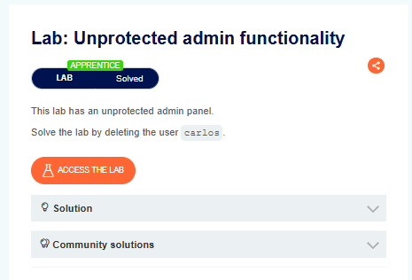

---

## Screenshot 2: Accessing the Lab

I clicked **Access the Lab**, which opened the application's home page.

The home page displayed different products.

Since the objective was to delete the user `carlos`, I started exploring the application to identify any functionality related to administration or user management.


---

## Screenshot 3: Exploring Product Details

While exploring the home page, I noticed that every product had a **View details** button.

I clicked on one of the products to check whether the product page contained any useful information or clues related to the administrator functionality.

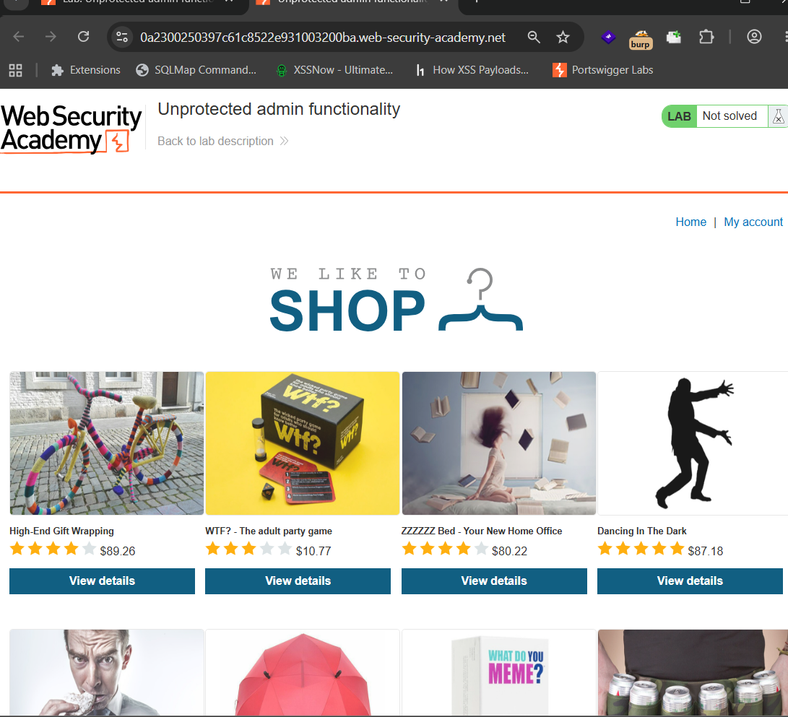

---

## Screenshot 4: Checking the Product Page

After opening the product page, I examined the available information.

However, I did not find any useful clues related to the administrator panel or user management functionality.

Therefore, I clicked **Return to list** and continued exploring other parts of the application.

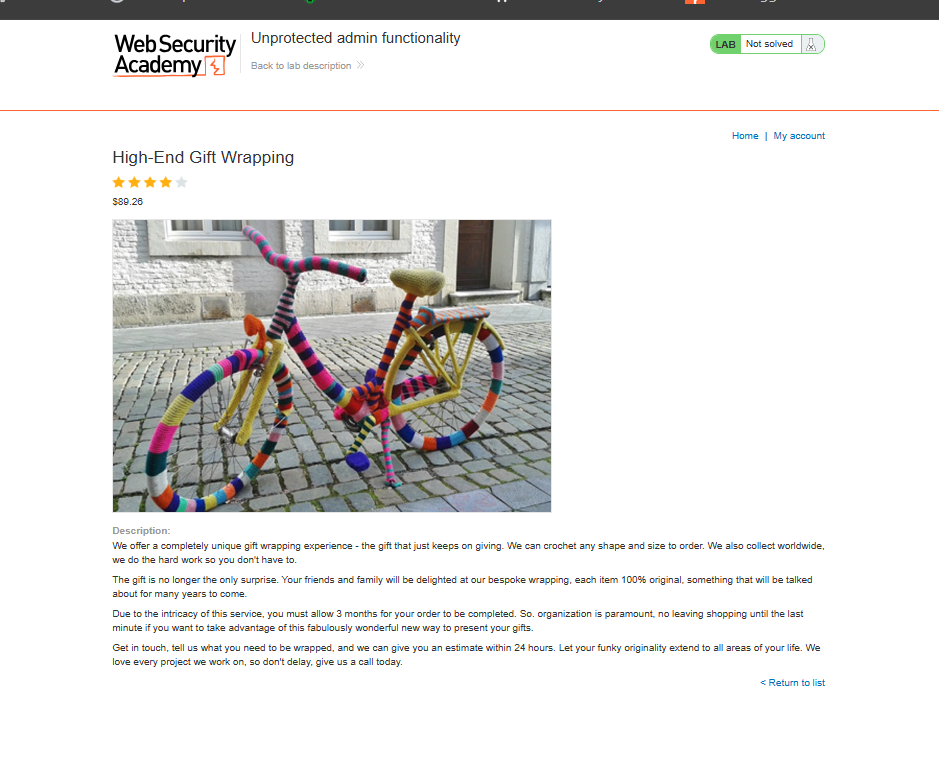

---

## Screenshot 5: Exploring My Account

After returning to the home page, I noticed the **My account** functionality.

To understand what functionality was available, I clicked on **My account**.

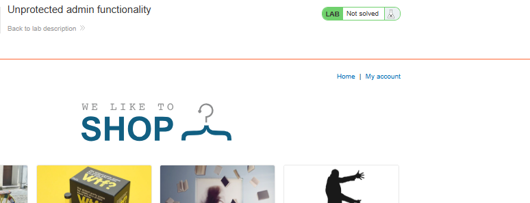

---

## Screenshot 6: Login Page

The **My account** option redirected me to a login page.

I considered whether authentication could provide access to additional functionality, including the administrator panel.

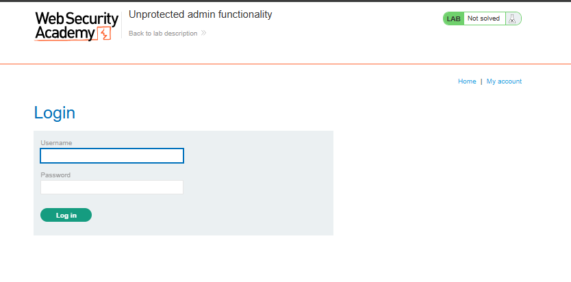

---

## Screenshot 7: Testing Login Credentials

I entered the following credentials:

```text
Username: admin
Password: password
```

I then attempted to log in to check whether these credentials could provide administrative access.

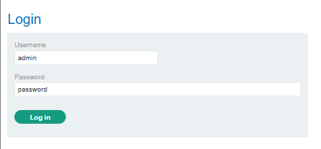

---

## Screenshot 8: Login Attempt Failed

The login attempt failed, and the application displayed an error message indicating that the username or password was incorrect.

Since the tested credentials did not work, I continued investigating other possible ways to locate the administrator functionality.

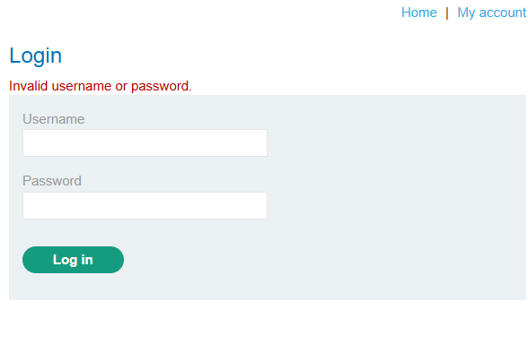

---

## Screenshot 9: Inspecting the Login Request

Next, I captured and examined the login request.

I checked the request for possible hidden paths or information related to administrator functionality.

However, I did not find any useful information about the administrator panel through this approach.

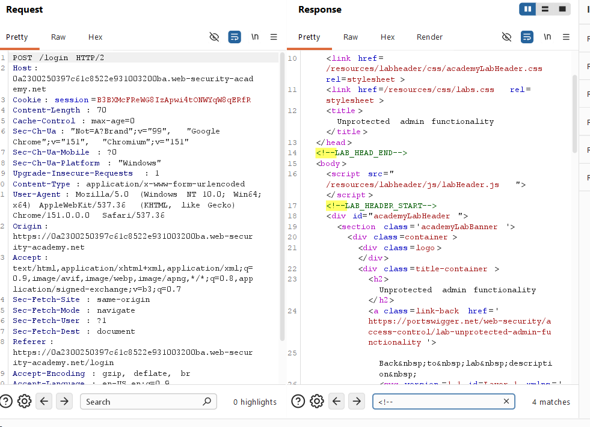

---

## Screenshot 10: Checking `robots.txt`

Since the lab description mentioned an **unprotected admin panel**, I considered that the administrator functionality might exist at a hidden or unlinked path.

I checked:

```text
/robots.txt
```

The `robots.txt` file revealed:

```text
/administrator-panel
```

This gave me a possible location for the administrator panel.

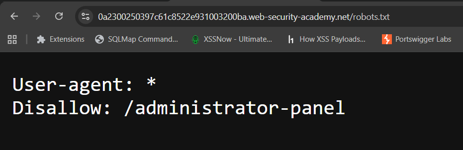

---

## Screenshot 11: Accessing the Administrator Panel

Using the discovered path, I navigated to:

```text
/administrator-panel
```

The administrator panel was accessible without requiring administrator authentication.

The page displayed the available users and provided an option to delete them.

This confirmed that sensitive administrative functionality was exposed without proper access control.

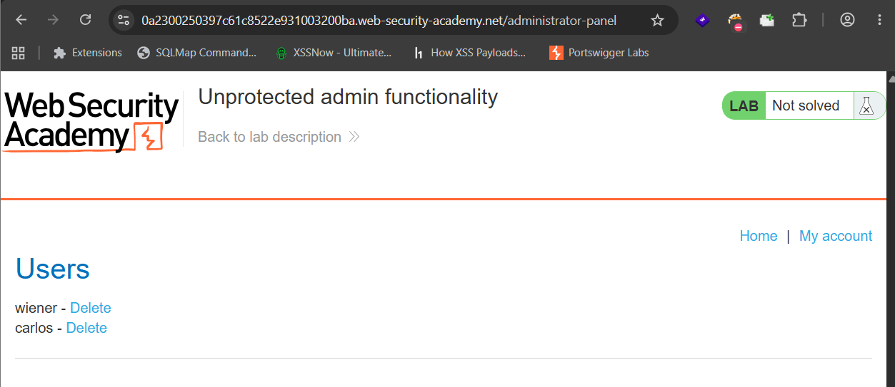

---

## Screenshot 12: Testing the Delete Functionality

I first clicked the delete option for the user **`wiener`** to understand how the functionality worked.

The application confirmed that the user was successfully deleted.

This demonstrated that the administrator panel allowed user deletion without proper authorization.

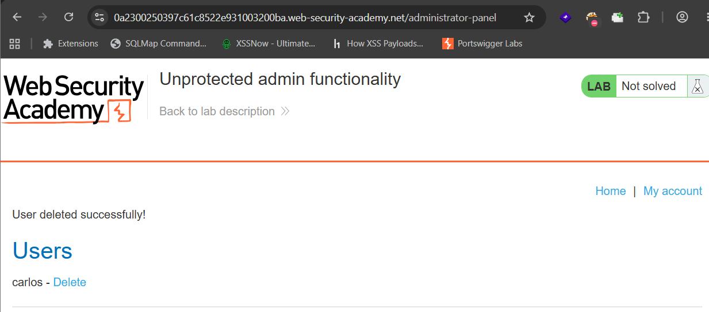

---

## Screenshot 13: Deleting the Target User `carlos`

Finally, I clicked the delete option for the target user:

```text
carlos
```

The user was successfully deleted, and the lab was marked as **Solved**.

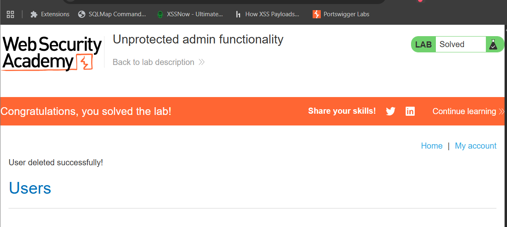

---

# 🔍 Different Possibilities I Considered

During the lab, I explored several possible approaches:

- Exploring the product pages.
- Checking the **My account** functionality.
- Testing common administrator credentials.
- Inspecting the login request.
- Looking for hidden or unlinked paths.
- Checking the `robots.txt` file.
- Accessing the discovered `/administrator-panel` path.

The `robots.txt` file ultimately revealed the location of the administrator panel.

---

# ⚡ How the Vulnerability Was Confirmed

The vulnerability was confirmed when I accessed:

```text
/administrator-panel
```

without authenticating as an administrator.

The panel provided access to sensitive user management functionality and allowed users to be deleted.

Finally, I successfully deleted the target user:

```text
carlos
```

This confirmed that the administrator functionality was not properly protected.

---

# 🎯 Root Cause

The root cause of the vulnerability was **missing access control**.

The application exposed administrative functionality at:

```text
/administrator-panel
```

However, the application did not properly verify whether the user accessing this functionality was authorized.

The administrator panel was hidden from the normal application navigation, but hiding a URL does not provide security.

The path was also visible through:

```text
/robots.txt
```

This demonstrates that **security through obscurity is not a reliable security control**.

---

# 🛡️ Remediation

## 1. Implement Proper Authentication

Administrative functionality should require users to authenticate before access is granted.

## 2. Implement Proper Authorization

The application should verify that the authenticated user has administrator permissions before allowing access to sensitive functionality.

## 3. Enforce Server-Side Access Control

Authorization checks should be performed on the server side before allowing sensitive actions.

## 4. Do Not Rely on Hidden URLs

Hidden or unlinked URLs should never be considered a security control.

Sensitive paths may be discovered through:

- `robots.txt`
- Source code
- Application requests
- Directory enumeration
- Documentation

## 5. Protect Sensitive Actions

Actions such as deleting users should independently verify whether the current user has the required permissions.

## 6. Perform Regular Access Control Testing

Applications should be regularly tested for:

- Missing authentication
- Missing authorization
- Broken access control
- Exposed administrative functionality
- Unauthorized access to sensitive endpoints

---

# 📚 Key Learning

Through this lab, I learned that:

- Hidden functionality is not the same as secured functionality.
- Administrative functionality must have proper authentication and authorization.
- `robots.txt` can reveal interesting paths during authorized security testing.
- Security should not rely on hiding URLs.
- Access control should be enforced on the server side.
- Sensitive actions require proper authorization checks.
- Unprotected administrative functionality can allow unauthorized users to perform critical actions.

---

# 🎓 My Biggest Takeaway

> **A hidden URL is not a security control.**

Even if an administrator panel is not directly visible in the application, it can still be discovered.

Therefore, the application must always verify:

```text
Who is accessing the resource?
        ↓
Are they authenticated?
        ↓
Are they authorized?
```

Proper authentication and authorization are essential for protecting sensitive functionality.

---

# 🏁 Conclusion

In this lab, I successfully identified an unprotected administrator panel.

I started by exploring the application and checking its available functionalities. After testing the product pages, login functionality, and login request, I investigated possible hidden paths.

By checking:

```text
/robots.txt
```

I discovered:

```text
/administrator-panel
```

The administrator panel was accessible without proper authentication.

From the panel, I was able to access user management functionality and delete users.

Finally, I deleted the target user **`carlos`**, which successfully solved the lab.

This lab reinforced an important security principle:

> **Sensitive functionality must always be protected with proper authentication and authorization. Hiding a URL is not a substitute for access control.**

---

# 🧠 Learning Summary

| Category | Details |
|---|---|
| **Lab Name** | Unprotected admin functionality |
| **Difficulty** | Apprentice |
| **Vulnerability Type** | Unprotected Admin Functionality |
| **Category** | Broken Access Control |
| **Discovery Method** | Application exploration and `robots.txt` |
| **Admin Path** | `/administrator-panel` |
| **Affected Functionality** | Administrator panel and user deletion |
| **Impact** | Unauthorized users could access administrative functionality |
| **Lab Objective** | Delete the user `carlos` |
| **Result** | Successfully Solved |

---

# 🔐 Vulnerability Type

**Unprotected Admin Functionality**

This vulnerability occurs when sensitive administrative features are accessible without proper authentication or authorization checks.

It can allow unauthorized users to access sensitive functionality and perform actions that should normally be restricted to administrators.

---

# ⚠️ Disclaimer

This write-up documents my learning process while practicing in the **PortSwigger Web Security Academy**.

All testing was performed in an authorized and controlled environment created for cybersecurity education and learning purposes.

The techniques documented in this repository are intended only for:

- Educational purposes
- Hands-on cybersecurity learning
- Understanding web application security
- Authorized security testing

**Do not use these techniques against systems without proper authorization.**

---

## 👨‍💻 Author

**Guru Chandrayudu**

Cybersecurity Learner | Web Security Enthusiast