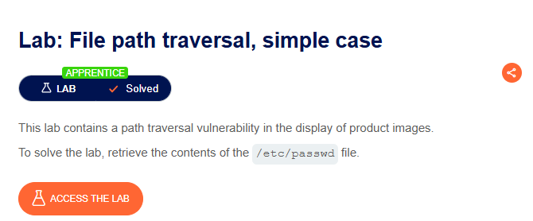
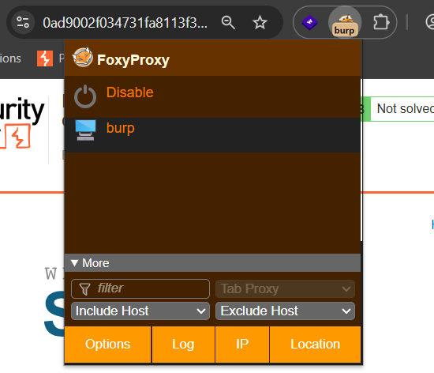
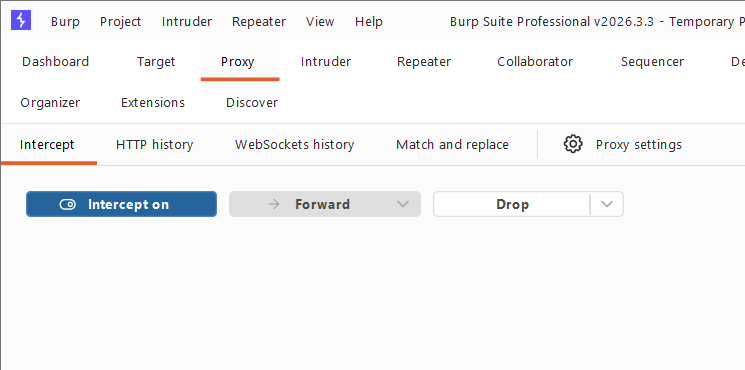
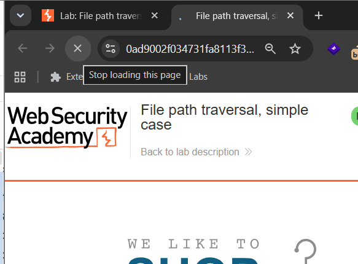
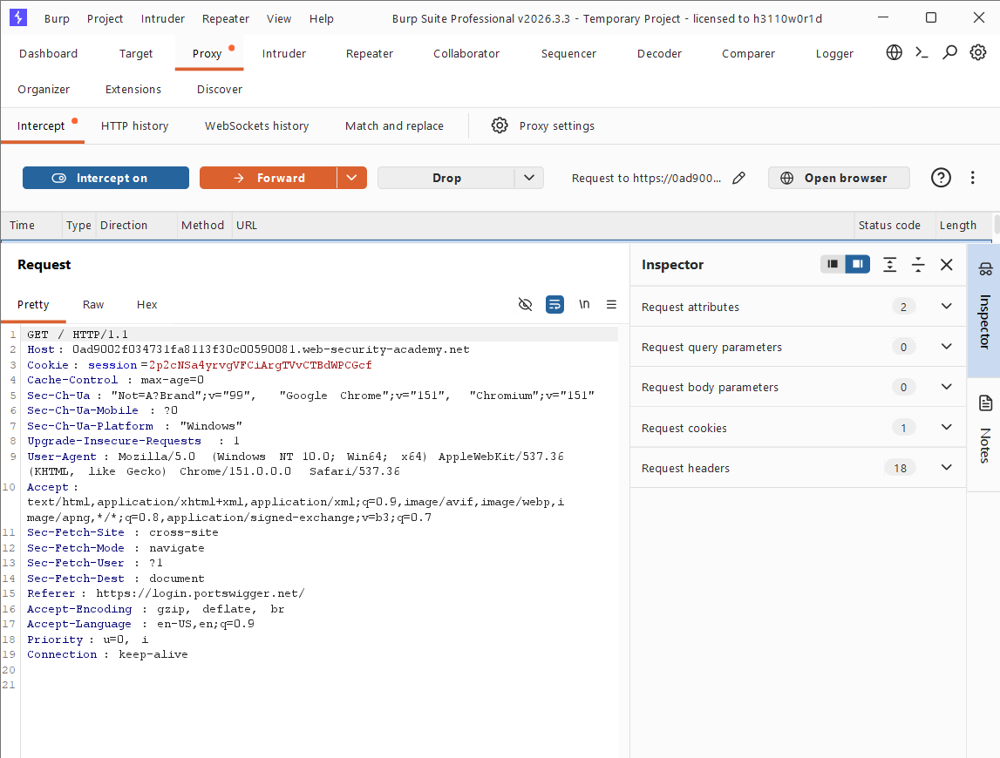
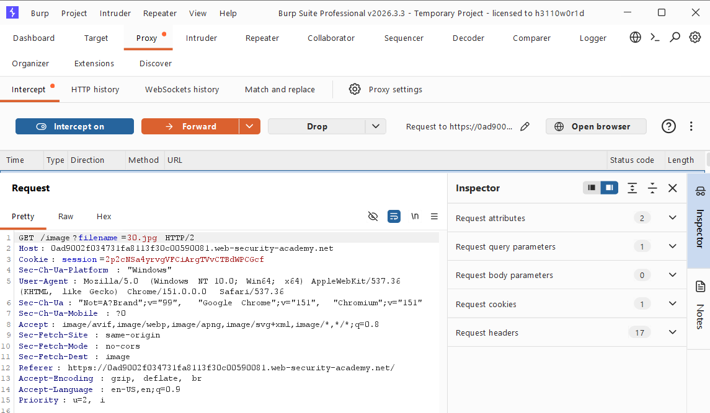
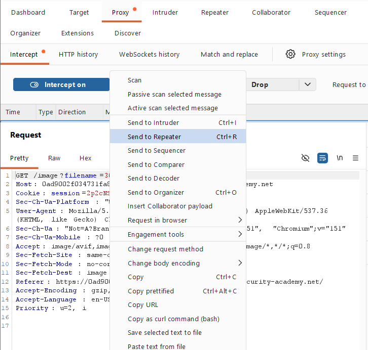
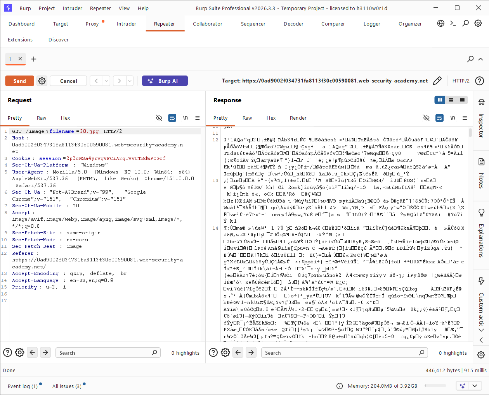
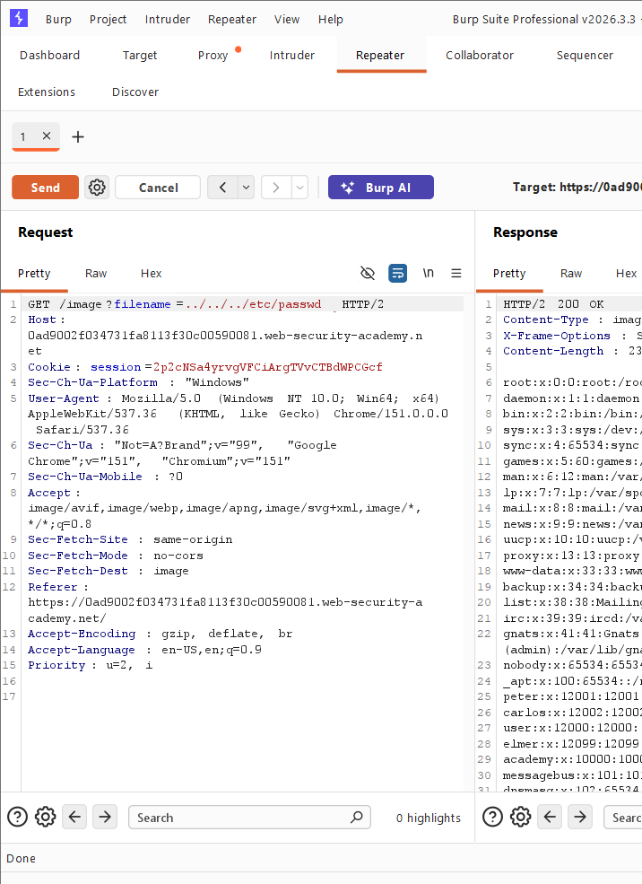

# 🔐 Lab 01: File Path Traversal — Simple Case

> **Platform:** PortSwigger Web Security Academy  
> **Difficulty:** Apprentice  
> **Vulnerability Type:** File Path Traversal / Directory Traversal  
> **Status:** ✅ Solved

---

## 🧪 Lab Overview

This lab contains a **path traversal vulnerability** in the functionality used to display product images.

The application accepts a filename through a request parameter and uses that value to retrieve a file from the server.

The lab objective was to retrieve the contents of:

```text
/etc/passwd
```

The vulnerable functionality was identified through the following request:

```http
GET /image?filename=30.jpg HTTP/2
```

The `filename` parameter was user-controlled. By manipulating this parameter, it was possible to traverse outside the intended image directory and access a sensitive system file.

---

# 🎯 Lab Objective

Retrieve the contents of:

```text
/etc/passwd
```

and successfully solve the lab.

---

# 🛠️ Tools Used

- Burp Suite Professional
- FoxyProxy
- Google Chrome
- PortSwigger Web Security Academy

---

# 🧠 How I Approached the Problem

My approach to solving the lab was:

1. Access the vulnerable lab environment.
2. Configure the browser traffic to pass through Burp Suite.
3. Enable interception in Burp Suite.
4. Refresh the application to capture HTTP requests.
5. Inspect the captured requests.
6. Identify a parameter related to a file.
7. Find the following request:

```text
filename=30.jpg
```

8. Send the request to Burp Suite Repeater.
9. Test the original request and observe the response.
10. Replace the image filename with a path traversal payload.
11. Send the modified request.
12. Check whether the server returned the contents of `/etc/passwd`.
13. Confirm that the vulnerability exists.
14. Successfully solve the lab.

---

# 📸 Screenshot-by-Screenshot Explanation

## 📸 Screenshot 1 — Lab Introduction

The first screenshot shows the introduction to the lab.

### Lab Details

- **Lab Name:** File path traversal, simple case
- **Difficulty:** Apprentice
- **Status:** Solved

The lab description states that the application contains a **path traversal vulnerability** in the display of product images.

The objective is to retrieve the contents of:

```text
/etc/passwd
```


This indicates that the application may allow user-controlled input to influence which files are retrieved from the server.

---

## 📸 Screenshot 2 — Accessing the Lab

After clicking **Access the Lab**, the vulnerable web application opens.

The application displays an online shopping website with different products and product images.

At this stage, the goal was to understand how the application loads the product images and identify whether any request parameters could be manipulated.


---

## 📸 Screenshot 3 — Configuring FoxyProxy

To intercept the browser traffic, I enabled the **FoxyProxy** extension.

This allowed the browser requests to pass through Burp Suite.

The purpose was to capture and inspect the HTTP requests generated by the application.


---

## 📸 Screenshot 4 — Enabling Burp Suite Intercept

Next, I opened Burp Suite and navigated to:

```text
Proxy → Intercept
```

I enabled:

```text
Intercept is on
```

This allows Burp Suite to capture HTTP requests before they reach the server.

---

## 📸 Screenshot 5 — Refreshing the Homepage

After enabling interception, I returned to the lab homepage and refreshed the page.

Refreshing the page generated multiple HTTP requests.

These requests were captured by Burp Suite for further analysis.


---

## 📸 Screenshot 6 — Inspecting Captured Requests

I started checking the requests captured by Burp Suite.

Initially, the first request did not contain the file path or parameter I was looking for.

I checked:

- HTTP Method
- Host
- URL
- Request Path
- Query Parameters

Since the first request did not contain a useful parameter, I clicked **Forward** and continued checking the next requests.


---

## 📸 Screenshot 7 — Identifying the Filename Parameter

After inspecting the captured requests, I found an important request:

```http
GET /image?filename=30.jpg
```

The important parameter was:

```text
filename=30.jpg
```

This suggested that the application was using the value of the `filename` parameter to determine which image should be loaded.

Since the parameter was directly controlling a file name, it became the main target for path traversal testing.


---

# 🔍 Identifying the Vulnerable Parameter

The vulnerable request was:

```http
GET /image?filename=30.jpg HTTP/2
```

The parameter being tested was:

```text
filename=30.jpg
```

The application expects an image filename.

For example:

```text
30.jpg
```

However, if the application does not properly validate the value, an attacker may attempt to access files outside the intended directory.

---

## 📸 Screenshot 8 — Sending the Request to Repeater

To test the request manually, I right-clicked on the captured request and selected:

```text
Send to Repeater
```

Burp Suite Repeater allows a request to be modified and resent multiple times.

This makes it easier to test how the application responds to different input values.


---

## 📸 Screenshot 9 — Opening the Request in Repeater

The request was successfully opened in the **Repeater** tab.

The request looked similar to:

```http
GET /image?filename=30.jpg HTTP/2
Host: <lab-id>.web-security-academy.net
```

At this point, I could manually modify the `filename` parameter and send the request again.

---

## 📸 Screenshot 10 — Testing the Original Request

Before modifying the request, I first tested the original request.

I clicked the **Send** button.

The server returned:

```http
HTTP/2 200 OK
```

The response confirmed that:

- The request was valid.
- The endpoint was functioning correctly.
- The server was successfully returning the requested image.

Testing the original request first helped establish a baseline before modifying the parameter.

---

# ⚡ Testing for Path Traversal

The original request contained:

```text
filename=30.jpg
```

I replaced the filename with a path traversal sequence.

The modified value was:

```text
../../../etc/passwd
```

The request became:

```http
GET /image?filename=../../../etc/passwd HTTP/2
```

The `../` sequence is commonly used to move to a parent directory.

Conceptually:

```text
Current Directory
       │
       ▼
      ../
       │
       ▼
Parent Directory
       │
       ▼
      ../
       │
       ▼
Parent Directory
       │
       ▼
      ../
       │
       ▼
System Directory
       │
       ▼
   /etc/passwd
```

---

## 📸 Screenshot 11 — Injecting the Path Traversal Payload

In Burp Suite Repeater, I replaced:

```text
filename=30.jpg
```

with:

```text
filename=../../../etc/passwd
```

The modified request became:

```http
GET /image?filename=../../../etc/passwd HTTP/2
```

I then clicked the **Send** button.

The server responded successfully.

The response contained the contents of:

```text
/etc/passwd
```

The response included entries similar to:

```text
root:x:0:0:root:/root:/bin/bash
daemon:x:1:1:daemon:/usr/sbin:/usr/sbin/nologin
bin:x:2:2:bin:/bin:/usr/sbin/nologin
sys:x:3:3:sys:/dev:/usr/sbin/nologin
```

This confirmed that the application allowed access to files outside the intended image directory.

---

# ⚡ How the Vulnerability Was Confirmed

The vulnerability was confirmed because the application accepted:

```text
../../../etc/passwd
```

instead of the expected image filename:

```text
30.jpg
```

The server returned:

```http
HTTP/2 200 OK
```

and the response contained the contents of:

```text
/etc/passwd
```

This demonstrated that the application did not properly restrict the file path supplied through the `filename` parameter.

---

# 🔐 Vulnerability Type

## File Path Traversal

**File Path Traversal**, also known as **Directory Traversal**, occurs when an application allows user-controlled input to influence which files are accessed on the server.

For example, the application expects:

```text
filename=30.jpg
```

The expected flow is:

```text
User Request
     │
     ▼
filename=30.jpg
     │
     ▼
Application
     │
     ▼
Product Images Directory
     │
     ▼
30.jpg
```

However, the vulnerable application accepted:

```text
filename=../../../etc/passwd
```

This allowed traversal outside the intended directory.

---

# 🔍 Different Possibilities I Considered

During the lab, I considered different ways to identify the vulnerable functionality.

## 1. Checking the Direct URL

I checked whether the browser URL directly contained parameters related to files.

Not all vulnerable parameters are visible directly in the browser, so further inspection was required.

---

## 2. Inspecting HTTP Requests

I used Burp Suite to inspect the HTTP requests generated by the application.

I looked for parameters that could potentially control:

- Files
- Images
- Paths
- Documents
- Resources

---

## 3. Looking for File-Related Parameters

I specifically looked for parameters such as:

```text
filename
file
path
image
document
```

The important parameter found in this lab was:

```text
filename=30.jpg
```

---

## 4. Testing the Original Request

Before testing a payload, I first sent the original request.

This confirmed that:

- The endpoint was valid.
- The server returned a successful response.
- The parameter controlled the requested resource.

---

## 5. Modifying the File Path

After confirming that the parameter controlled the requested file, I replaced the original filename with:

```text
../../../etc/passwd
```

The response returned the contents of the target file.

This confirmed the path traversal vulnerability.

---

# 🎯 Root Cause

The root cause of the vulnerability is that the application trusts user-controlled input when accessing files.

The application accepts:

```text
filename=30.jpg
```

and uses this value to retrieve a file.

However, the application does not properly prevent a user from modifying the value to:

```text
../../../etc/passwd
```

Because the input is not properly restricted, the attacker can attempt to move outside the intended directory.

The application failed to properly:

- Validate the input.
- Restrict file access to the intended directory.
- Prevent directory traversal sequences.
- Use an allowlist of approved files.
- Verify the final resolved file path.

---

# 🛡️ Remediation

Several security controls can help prevent path traversal vulnerabilities.

## 1. Avoid Direct User-Controlled File Paths

Avoid directly using user input as a file path.

Instead of:

```text
filename=user_input
```

use an indirect reference:

```text
image_id=123
```

The server can internally map the ID to an approved file.

---

## 2. Use an Allowlist

Only allow expected filenames or resources.

For example:

```text
Allowed Files:

30.jpg
31.jpg
32.jpg
```

Unexpected input should be rejected.

For example:

```text
../../../etc/passwd
```

should not be accepted.

---

## 3. Normalize and Validate File Paths

The application should resolve the requested file path and verify that the final path remains inside the allowed directory.

Conceptually:

```text
User Input
    │
    ▼
Normalize File Path
    │
    ▼
Check Allowed Directory
    │
    ├── Inside Allowed Directory → Allow
    │
    └── Outside Allowed Directory → Reject
```

---

## 4. Apply the Principle of Least Privilege

The web application should run with only the permissions required for its normal operation.

If the application has limited file system permissions, the impact of a vulnerability may be reduced.

---

## 5. Do Not Expose Sensitive Files

Sensitive files should be protected through proper operating system permissions and application-level access controls.

---

# 📚 Key Learning

This lab helped me understand how a simple parameter such as:

```text
filename=30.jpg
```

can become dangerous if the application directly trusts user input.

Important steps I learned during this lab include:

```text
Capture Request
      │
      ▼
Inspect Parameters
      │
      ▼
Identify File-Related Input
      │
      ▼
Send Request to Repeater
      │
      ▼
Test Original Response
      │
      ▼
Modify Parameter
      │
      ▼
Test Path Traversal
      │
      ▼
Analyze Response
      │
      ▼
Confirm Vulnerability
```

---

# 🧠 Learning Summary

### What I learned from this lab:

- How to configure FoxyProxy with Burp Suite.
- How to enable request interception.
- How to capture HTTP requests.
- How to inspect request parameters.
- How to identify file-related parameters.
- How to use Burp Suite Repeater.
- How to compare normal and modified requests.
- How a path traversal vulnerability works.
- Why user-controlled file paths are dangerous.
- How directory traversal can lead to unauthorized file access.
- Basic remediation techniques for preventing path traversal.

---

# 🎓 My Biggest Takeaway

My biggest takeaway from this lab is:

> **Never trust user-controlled input when it is used to access server-side files.**

A parameter that appears simple, such as:

```text
filename=30.jpg
```

can become a serious security issue if the application does not properly validate the input.

By modifying the parameter to:

```text
../../../etc/passwd
```

the application returned a sensitive system file instead of the expected product image.

This lab also helped me understand the practical workflow of using Burp Suite for:

- Request interception
- Parameter analysis
- Request modification
- Response analysis
- Vulnerability confirmation

---

# 🏁 Conclusion

In this lab, I successfully identified and confirmed a **File Path Traversal vulnerability** in the product image functionality.

The vulnerable parameter was:

```text
filename=30.jpg
```

By modifying the parameter to:

```text
../../../etc/passwd
```

the application returned the contents of:

```text
/etc/passwd
```

This confirmed that the application did not properly restrict user-controlled file paths.

The vulnerability was successfully demonstrated in the authorized PortSwigger Web Security Academy lab environment.

**Lab Status:** ✅ Solved

---

# 📁 Project Structure

```text
Lab-02-File-Path-Traversal-Simple-Case/
│
├── README.md
├── Lab-02-File-Path-Traversal-Simple-Case.docx
│
└── images/
    ├── screenshot-1-lab-overview.png
    ├── screenshot-2-access-lab.png
    ├── screenshot-3-foxyproxy-enabled.png
    ├── screenshot-4-burp-intercept-on.png
    ├── screenshot-5-refresh-homepage.png
    ├── screenshot-6-inspecting-requests.png
    ├── screenshot-7-filename-parameter.png
    ├── screenshot-8-send-to-repeater.png
    ├── screenshot-9-repeater-request.png
    ├── screenshot-10-normal-response.png
    ├── screenshot-11-path-traversal-payload.png
    └── screenshot-12-lab-solved.png
```

---

# ⚠️ Disclaimer

This write-up is created **strictly for educational purposes**.

All testing and exploitation demonstrated in this repository were performed in an intentionally vulnerable and authorized environment provided by:

**PortSwigger Web Security Academy**

Do not perform similar testing against websites, applications, servers, or systems without explicit authorization.

Unauthorized security testing may be illegal and unethical.

---

## 👨‍💻 Author

**Guru Chandrayudu**

Cybersecurity Student | Security Enthusiast

---

⭐ **If you found this write-up useful, consider starring the repository!**