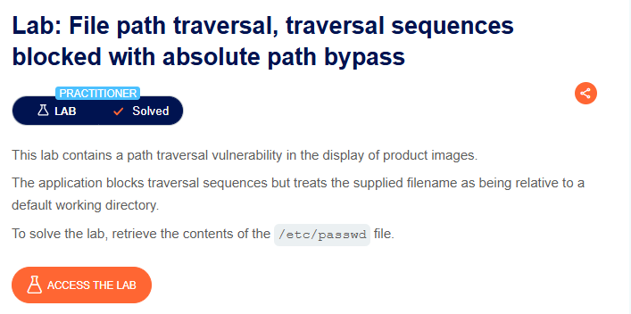
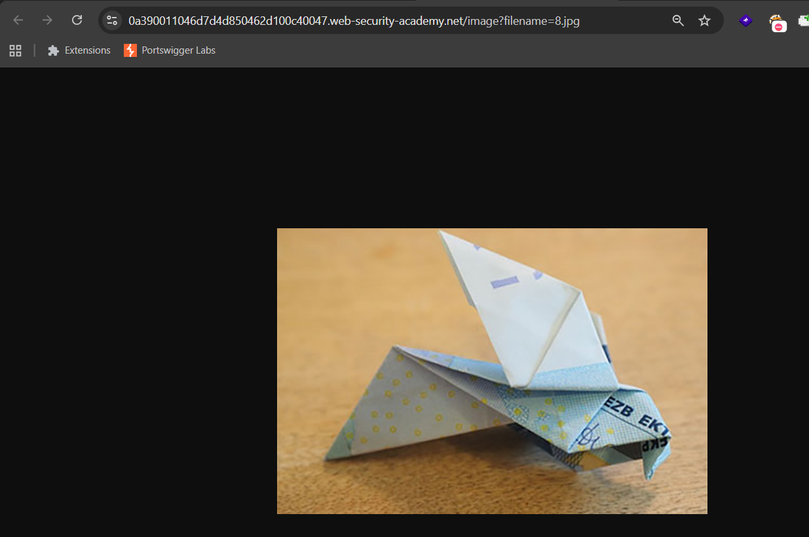
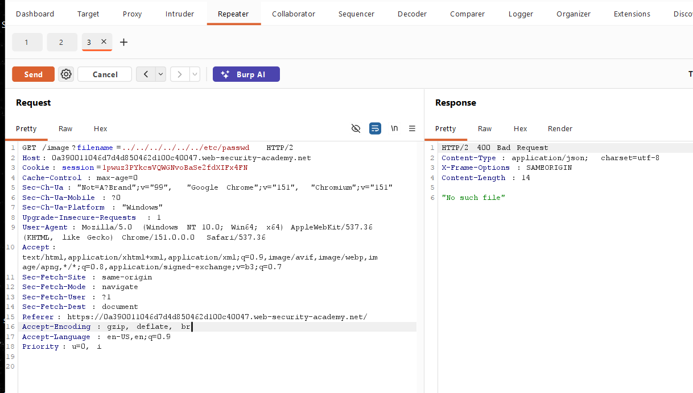
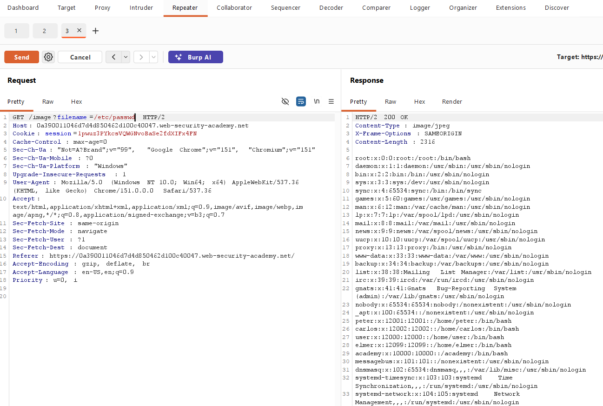

# 🔐 PortSwigger Lab: File Path Traversal – Traversal Sequences Blocked with Absolute Path Bypass

## 🧪 Lab Overview

**Lab Name:** File path traversal, traversal sequences blocked with absolute path bypass  
**Difficulty:** Practitioner  
**Status:** Solved  
**Vulnerability Type:** File Path Traversal  

This lab contains a **file path traversal vulnerability** in the functionality used to display product images.

The application blocks traditional path traversal sequences such as:

```text
../../../etc/passwd
```

However, the application can be bypassed by supplying an **absolute file path**.

The objective of this lab was to retrieve the contents of:

```text
/etc/passwd
```

---

## 🧠 How I Approached the Problem

I started by accessing the lab and exploring the application.

Since the lab description mentioned that the vulnerability existed in the display of product images, I focused on understanding how the application retrieved images from the server.

I opened one of the product images in a new tab and observed that the URL contained a `filename` parameter similar to:

```text
/image?filename=8.jpg
```

This indicated that the application was using the value of the `filename` parameter to retrieve files from the server.

Since the parameter controlled which file was being accessed, I decided to test it for a possible file path traversal vulnerability.

I enabled **FoxyProxy** to route browser traffic through **Burp Suite** and captured the request.

First, I tested a traditional path traversal payload:

```text
filename=../../../../../../etc/passwd
```

However, the server returned:

```text
400 Bad Request
```

This showed that the application was blocking traversal sequences such as:

```text
../
```

Based on the lab description, I then tried using an absolute path instead.

I replaced the filename value with:

```text
/etc/passwd
```

The request was similar to:

```text
/image?filename=/etc/passwd
```

After sending the request, the server returned the contents of the `/etc/passwd` file.

This confirmed the vulnerability and successfully solved the lab.

---

# 📸 Screenshot-by-Screenshot Explanation

## Screenshot 1: Lab Description

This screenshot shows the lab:

**File path traversal, traversal sequences blocked with absolute path bypass**

The lab description explains that the application contains a path traversal vulnerability in the functionality used to display product images.

The application blocks normal traversal sequences, but an absolute path can potentially bypass the restriction.

The objective of the lab is to retrieve:

```text
/etc/passwd
```



---

## Screenshot 2: Accessing the Lab

After clicking **Access the Lab**, the application's home page opened.

The application displayed multiple products with images.

Since the lab description mentioned that the vulnerability existed in the product image functionality, I focused on understanding how the images were being loaded from the server.


---

## Screenshot 3: Opening a Product Image

To identify the endpoint responsible for retrieving product images, I right-clicked on one of the product images.

I selected:

```text
Open image in new tab
```

This opened the image directly in a new browser tab and allowed me to inspect the URL used by the application to retrieve the image.


---

## Screenshot 4: Identifying the `filename` Parameter

After opening the image in a new tab, I observed that the URL contained a parameter similar to:

```text
/image?filename=8.jpg
```

The `filename` parameter appeared to control which file was retrieved from the server.

Since user-controlled file parameters can sometimes be vulnerable to file path traversal, I decided to test this parameter.

Before testing, I enabled **FoxyProxy** so that the browser traffic would be routed through **Burp Suite**.



---

## Screenshot 5: Testing Traditional Path Traversal

In Burp Suite, I first confirmed that the request was being sent to the correct lab host.

After confirming the target, I modified the `filename` parameter and tested a traditional path traversal payload:

```text
filename=../../../../../../etc/passwd
```

After clicking **Send**, the server returned:

```text
400 Bad Request
```

This indicated that the application was blocking traversal sequences such as:

```text
../
```

Since the traditional traversal payload was blocked, I referred back to the lab description and considered testing an absolute path instead.



---

## Screenshot 6: Testing the Absolute Path Bypass

Since the traditional path traversal payload was blocked, I replaced the `filename` value with an absolute path:

```text
/etc/passwd
```

The request was similar to:

```text
/image?filename=/etc/passwd
```

After clicking **Send**, the server returned the contents of the `/etc/passwd` file.

This confirmed that although the application blocked traditional traversal sequences, it did not properly restrict absolute file paths.

The vulnerability was successfully exploited, and the lab was marked as **Solved**.



---

# 🔍 Different Possibilities I Considered

During this lab, I considered several approaches:

- Identifying the endpoint used to retrieve product images.
- Inspecting the `filename` parameter.
- Testing traditional path traversal sequences using `../`.
- Observing the server response.
- Checking whether traversal sequences were blocked.
- Testing an absolute file path.
- Requesting the `/etc/passwd` file directly.

The traditional traversal payload was blocked:

```text
../../../../../../etc/passwd
```

The successful approach was using the absolute path:

```text
/etc/passwd
```

---

# ⚡ How the Vulnerability Was Confirmed

The vulnerability was confirmed when the application successfully returned the contents of a sensitive system file using:

```text
filename=/etc/passwd
```

The traditional payload:

```text
filename=../../../../../../etc/passwd
```

was rejected with a `400 Bad Request` response.

However, directly supplying the absolute path bypassed the application's filtering.

The successful response containing the `/etc/passwd` file confirmed that the application did not properly validate user-controlled file paths.

---

# 🎯 Root Cause

The root cause of the vulnerability was insufficient server-side validation of user-controlled file paths.

The application attempted to block traversal sequences such as:

```text
../
```

However, blocking only specific malicious patterns is not enough.

The application still accepted an absolute file path:

```text
/etc/passwd
```

As a result, a user could request files outside the intended directory.

This demonstrates why relying only on filtering known malicious patterns can lead to security bypasses.

---

# 🛡️ Remediation

## 1. Use an Allowlist of Files

Instead of allowing users to supply arbitrary file paths, the application should only allow access to predefined files.

For example:

```text
product-image-1.jpg
product-image-2.jpg
product-image-3.jpg
```

---

## 2. Avoid Using User Input Directly in File Paths

User-controlled input should not be directly used to construct server-side file paths.

Instead, the application should map user input to safe and predefined resources.

---

## 3. Validate and Normalize File Paths

The application should validate the final resolved file path before accessing the file.

The resolved path should always remain inside the intended application directory.

---

## 4. Restrict Access Outside the Intended Directory

The server should ensure that requests cannot access files outside the application's allowed file storage directory.

Sensitive directories such as:

```text
/etc/
```

should never be accessible through user-controlled parameters.

---

## 5. Use Proper Server-Side Validation

Security checks should be performed on the server side.

The application should validate the complete resolved path instead of only blocking specific strings such as:

```text
../
```

---

# 📚 Key Learning

Through this lab, I learned that:

- File path traversal can occur when user input controls a server-side file path.
- Blocking only `../` is not sufficient protection.
- Absolute paths can sometimes bypass weak traversal filters.
- User-controlled input should not directly determine which server-side file is accessed.
- Proper server-side path validation is essential.
- Burp Suite can be used to capture and modify requests during authorized testing.
- Different payload variations can produce different server responses.
- Security controls should validate allowed input rather than only block known malicious patterns.

---

# 🎓 My Biggest Takeaway

> **Blocking one malicious pattern does not mean the application is secure.**

In this lab, the application successfully blocked:

```text
../../../../../../etc/passwd
```

However, it still accepted:

```text
/etc/passwd
```

This demonstrates that a blacklist-based approach can be bypassed.

A stronger approach is to use proper validation and ensure that the requested file always remains inside an allowed directory.

---

# 🏁 Conclusion

In this lab, I successfully exploited a file path traversal vulnerability using an absolute path bypass.

I started by identifying how product images were retrieved from the server and found a user-controlled `filename` parameter.

I first tested a traditional path traversal payload:

```text
../../../../../../etc/passwd
```

However, the application blocked the request with a `400 Bad Request` response.

Based on the lab description, I then tested an absolute path:

```text
/etc/passwd
```

The server returned the contents of the requested file, confirming the vulnerability.

This lab demonstrated an important security lesson:

> **Blocking traversal sequences alone is not enough. Applications must properly validate file paths and restrict access to authorized directories.**

---

# 🧠 Learning Summary

| Category | Details |
|---|---|
| **Lab Name** | File path traversal, traversal sequences blocked with absolute path bypass |
| **Difficulty** | Practitioner |
| **Vulnerability Type** | File Path Traversal |
| **Affected Functionality** | Product image display |
| **Parameter Tested** | `filename` |
| **Traditional Payload** | `../../../../../../etc/passwd` |
| **Traditional Payload Result** | `400 Bad Request` |
| **Successful Payload** | `/etc/passwd` |
| **Bypass Technique** | Absolute Path |
| **Testing Tool** | Burp Suite |
| **Proxy Tool** | FoxyProxy |
| **Lab Objective** | Retrieve the contents of `/etc/passwd` |
| **Result** | Successfully Solved |

---

# 🔐 Vulnerability Type

## File Path Traversal

File path traversal, also known as **directory traversal**, occurs when an application allows user-controlled input to access files outside the intended directory.

A vulnerable application may allow an attacker to manipulate a file parameter.

For example:

```text
filename=../../../etc/passwd
```

Even when traditional traversal sequences are blocked, weak validation may still allow alternative bypasses.

For example:

```text
filename=/etc/passwd
```

In this lab, the application blocked traditional traversal sequences but accepted an absolute path.

This allowed access to the `/etc/passwd` file and demonstrated that the application's path validation was insufficient.

---

# ⚠️ Disclaimer

This write-up documents my learning process while practicing in the **PortSwigger Web Security Academy**.

All testing was performed in an authorized and controlled environment designed for cybersecurity education and learning purposes.

The techniques documented in this repository are intended only for:

- Educational purposes
- Hands-on cybersecurity learning
- Understanding web application security
- Authorized security testing

**Do not use these techniques against systems, applications, or networks without proper authorization.**

---

## 👨‍💻 Author

**Guru Chandrayudu**

Cybersecurity Learner | Web Security Enthusiast