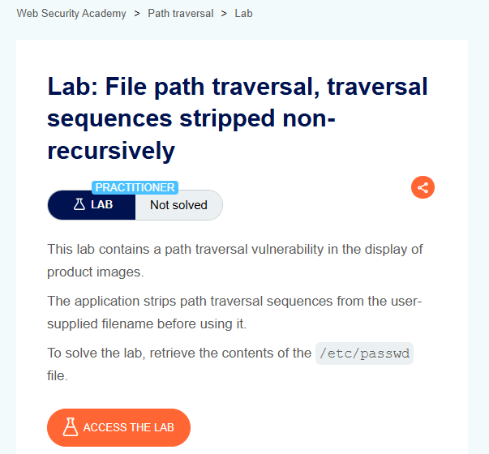
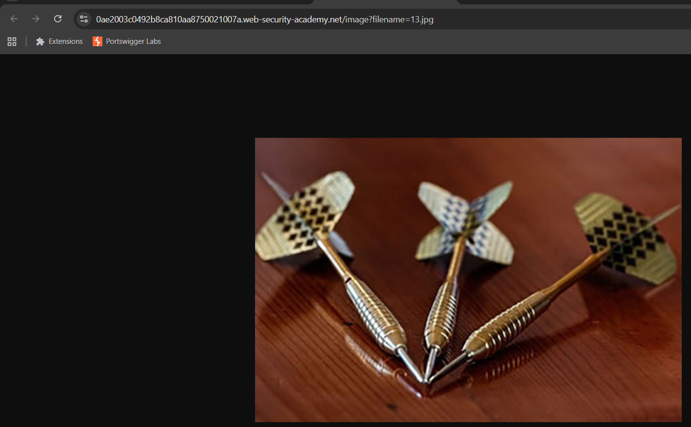
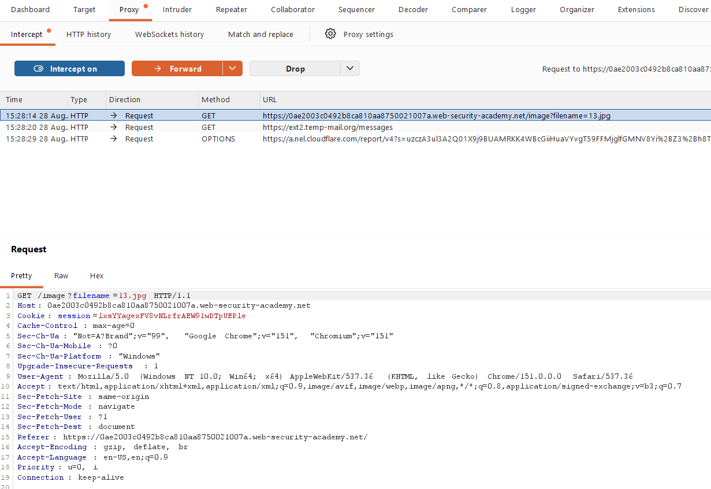
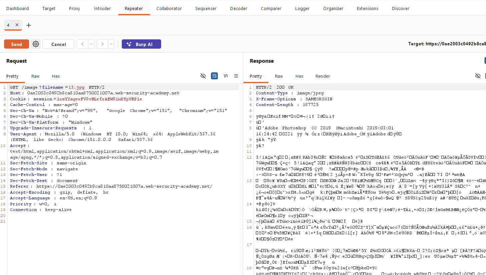
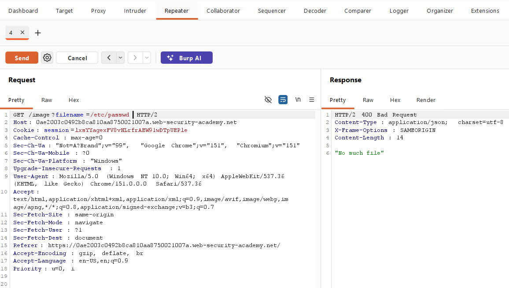
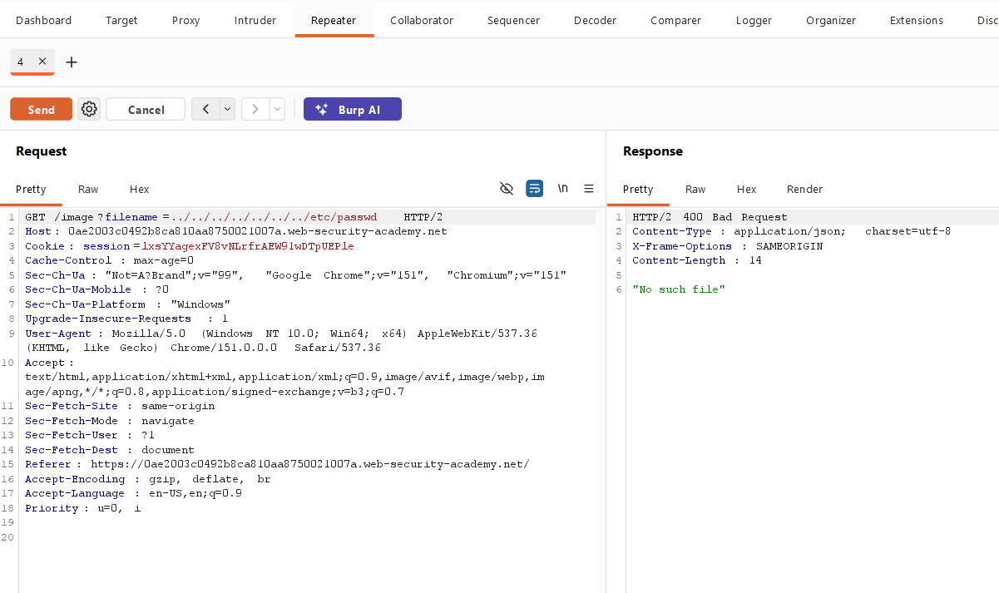
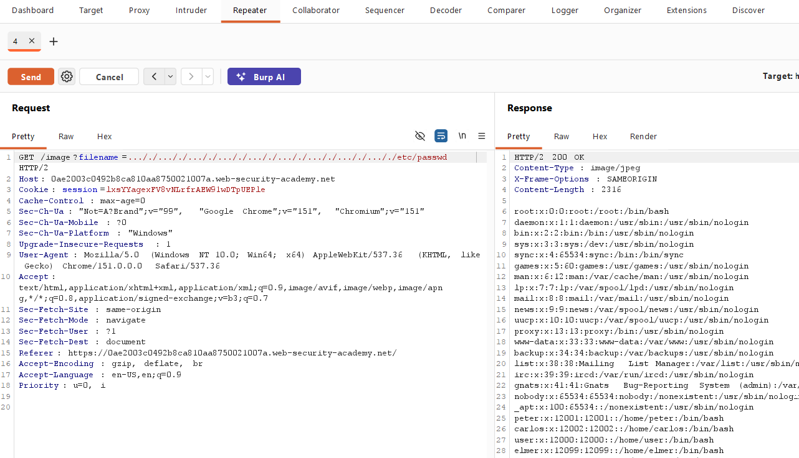
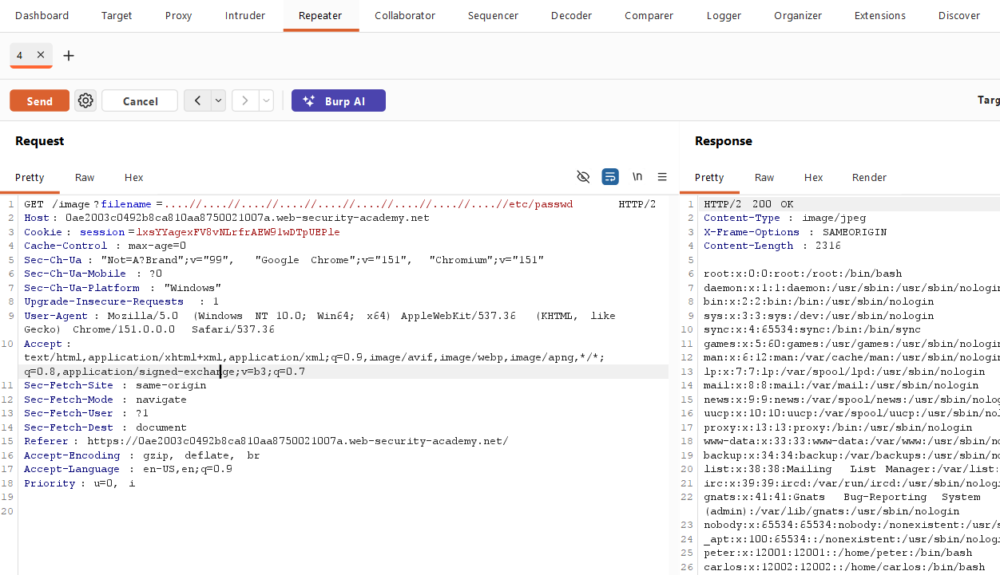
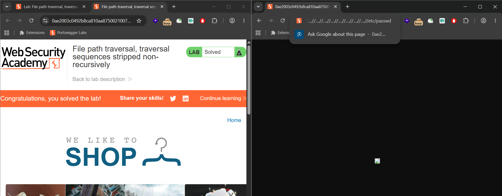

# 🔐 PortSwigger Lab: File Path Traversal, Traversal Sequences Stripped Non-Recursively

## 🧪 Lab Overview

**Lab Name:** File Path Traversal, Traversal Sequences Stripped Non-Recursively  
**Platform:** PortSwigger Web Security Academy  
**Difficulty:** Practitioner  
**Status:** Solved  
**Vulnerability Type:** File Path Traversal / Directory Traversal

This lab contains a **file path traversal vulnerability** in the product image functionality.

The application accepts a `filename` parameter but attempts to remove path traversal sequences such as `../`.

However, the filtering is performed only once. This makes it possible to bypass the protection using a specially crafted payload and access the `/etc/passwd` file.

The objective of this lab was to retrieve the contents of:

```text
/etc/passwd
```

---

# 🧠 How I Approached the Problem

I started by accessing the lab and exploring the application to understand how the product images were being loaded.

After opening the lab, I observed a shopping website containing several product images.

Since the vulnerability was related to the display of product images, I selected one of the images and opened it in a new browser tab.

The image URL contained a `filename` parameter:

```text
filename=13.jpg
```

This indicated that the application was using user-controlled input to determine which image file should be loaded.

I then configured **FoxyProxy** to route the browser traffic through **Burp Suite**.

In Burp Suite, I enabled:

```text
Proxy → Intercept
```

I refreshed the image request and captured it.

After capturing the request, I sent it to **Burp Repeater** so that I could manually modify the `filename` parameter and test different payloads.

First, I tested the direct absolute path:

```text
/etc/passwd
```

This returned a `400 Bad Request` response with:

```text
"No such file"
```

I then tried a normal path traversal payload:

```text
../../../../../../../etc/passwd
```

This also returned a `400 Bad Request`.

Based on the lab description and the failed requests, I understood that the application was filtering normal `../` traversal sequences.

I then analyzed the filtering behavior and recognized that the filtering was performed **non-recursively**, meaning the application removed traversal sequences only once.

I tested a specially crafted bypass payload:

```text
....//....//....//....//....//....//....//....//....//etc/passwd
```

The request successfully bypassed the filtering mechanism.

The server returned:

```text
200 OK
```

and the response contained the contents of:

```text
/etc/passwd
```

The lab was then successfully solved.

---

# 📸 Screenshot-by-Screenshot Explanation

## 📸 Screenshot 1 – Lab Description

The first screenshot shows the **File Path Traversal, Traversal Sequences Stripped Non-Recursively** lab in PortSwigger Web Security Academy.

The lab description explains that the application contains a path traversal vulnerability in the product image functionality.

It also explains that the application attempts to remove path traversal sequences from the user-supplied filename.

The objective is to retrieve the contents of:

```text
/etc/passwd
```

I clicked **Access the Lab** to begin the testing process.



---

## 📸 Screenshot 2 – Accessing the Application

After clicking **Access the Lab**, the application opened the shopping website.

The page displayed multiple products along with their images and other product information.

Since the lab description specifically mentioned the product image functionality, I started investigating how these images were being requested by the application.


---

## 📸 Screenshot 3 – Identifying the Filename Parameter

I selected one of the product images and used the browser option:

```text
Open image in new tab
```

The image opened in a separate browser tab.

After checking the URL, I noticed that the application used a parameter called:

```text
filename=13.jpg
```

This was an important observation because the filename was controlled through a URL parameter.

A user-controlled file parameter can potentially be tested for file path traversal.

I then configured **FoxyProxy** so that the browser traffic could be routed through Burp Suite.



---

## 📸 Screenshot 4 – Capturing the Request

I opened **Burp Suite** and enabled:

```text
Proxy → Intercept
```

I then returned to the browser and refreshed the image request.

Burp Suite intercepted the HTTP request generated by the browser.

The request contained the `filename` parameter, which confirmed that the image path could be controlled through the request.

This request became the main target for further testing.



---

## 📸 Screenshot 5 – Sending the Request to Repeater

After capturing the image request, I sent it to **Burp Repeater**.

Before modifying the request, I sent the original request to confirm that the image functionality was working normally.

The server returned:

```text
200 OK
```

and the requested image was successfully returned.

This confirmed that I had captured the correct request and could now safely modify the `filename` parameter in the authorized lab environment.



---

## 📸 Screenshot 6 – Testing an Absolute Path

I first tested whether the application would allow direct access to the target file using an absolute path.

I changed the filename parameter to:

```text
filename=/etc/passwd
```

I then sent the request from Burp Repeater.

The server returned:

```text
400 Bad Request
```

with the message:

```text
"No such file"
```

This showed that the direct absolute path attempt was not successful.

Therefore, I continued testing other possible approaches.



---

## 📸 Screenshot 7 – Testing Normal Path Traversal

Next, I tested a standard relative path traversal payload:

```text
../../../../../../../etc/passwd
```

I sent the modified request through Burp Repeater.

The server again returned:

```text
400 Bad Request
```

This indicated that the application was detecting or filtering the normal:

```text
../
```

path traversal sequences.

Since the standard traversal payload was blocked, I needed to understand how the application's filtering mechanism worked.



---

## 📸 Screenshot 8 – Understanding the Non-Recursive Filter

After the normal traversal payload failed, I analyzed the behavior described in the lab.

The application attempts to remove:

```text
../
```

from the supplied filename.

However, this filtering is performed only once.

For example, a specially constructed input such as:

```text
....//
```

can become:

```text
../
```

after one filtering operation.

The application does not process the resulting value again.

Therefore, a traversal sequence can remain after the filtering process.

This type of behavior is known as a:

**Non-recursive filtering bypass**

Understanding this filtering behavior helped me identify a suitable bypass payload.



---

## 📸 Screenshot 9 – Testing the Bypass Payload

I then tested a payload designed to bypass the non-recursive filtering:

```text
....//....//....//....//....//....//....//....//....//etc/passwd
```

I sent the request using Burp Repeater.

This time, the server returned:

```text
200 OK
```

The response contained the contents of:

```text
/etc/passwd
```

This was the key point of the lab because it demonstrated that the application's filtering mechanism could be bypassed.

The response confirmed that the user-controlled `filename` parameter could be used to access a file outside the intended image directory.



---

## 📸 Screenshot 10 – Solving the Lab

Finally, I opened the successful response in the browser.

The PortSwigger Web Security Academy lab displayed the:

```text
Solved
```

status.

This confirmed that I had successfully exploited the file path traversal vulnerability in the authorized lab environment.



---

# 🔍 Different Possibilities I Considered

During the testing process, I considered several possible approaches:

- Identifying how the application loads product images.
- Finding the `filename` parameter.
- Capturing the image request using Burp Suite.
- Sending the request to Burp Repeater.
- Testing direct access to `/etc/passwd`.
- Testing normal relative path traversal using `../`.
- Checking whether traversal sequences were being filtered.
- Understanding how the filtering mechanism processed the input.
- Testing a non-recursive filtering bypass.
- Confirming whether the response contained `/etc/passwd`.

The direct absolute path and normal traversal payloads failed.

The specially crafted bypass payload succeeded because the application removed traversal sequences only once.

---

# ⚡ How the Vulnerability Was Confirmed

The vulnerability was confirmed when the modified `filename` parameter returned:

```text
HTTP/2 200 OK
```

The response contained the contents of:

```text
/etc/passwd
```

The successful payload was:

```text
....//....//....//....//....//....//....//....//....//etc/passwd
```

The successful response demonstrated that the application allowed user-controlled input to access a file outside the intended directory.

This confirmed the presence of a **file path traversal vulnerability** caused by insufficient and non-recursive input filtering.

---

# 🎯 Root Cause

The root cause of the vulnerability was **improper input sanitization**.

The application attempted to protect against path traversal by removing:

```text
../
```

from the user-supplied filename.

However, the filtering was performed only once.

The application did not validate the resulting input again after the first filtering operation.

Because of this, specially crafted input could recreate traversal sequences after the filtering process.

This allowed the attacker-controlled filename to escape the intended directory and access:

```text
/etc/passwd
```

The main security issue was therefore relying on simple string replacement instead of securely resolving and validating the final file path.

---

# 🛡️ Remediation

## 1. Avoid Simple String Replacement

Applications should not rely on simply removing strings such as:

```text
../
```

from user input.

Blacklist-based filtering can often be bypassed using specially crafted input.

---

## 2. Use an Allowlist

The application should use an allowlist of valid filenames or internal file identifiers.

For example:

```text
product-image-1.jpg
product-image-2.jpg
product-image-3.jpg
```

Only approved files should be accessible.

---

## 3. Normalize the File Path

The application should normalize the requested path before accessing the file.

This helps ensure that traversal sequences and other path manipulation techniques are properly resolved.

---

## 4. Validate the Final Resolved Path

After resolving the requested path, the application should verify that the resulting path remains inside the intended directory.

For example:

```text
/application/images/
```

The final resolved path should never be allowed to escape this directory.

---

## 5. Avoid Direct User-Controlled File Access

User-controlled input should not directly determine which server-side file is accessed.

Instead, user input should be mapped to safe internal identifiers.

---

## 6. Apply Server-Side Validation

Security validation should always be performed on the server side.

Client-side restrictions should never be considered sufficient protection for file access.

---

# 📚 Key Learning

Through this lab, I learned that:

- File path traversal occurs when user-controlled input influences a server-side file path.
- Product image parameters can sometimes be useful targets for testing.
- Burp Suite can be used to intercept application requests.
- Burp Repeater is useful for manually modifying and testing requests.
- A direct absolute path may not always work.
- Normal `../` traversal sequences may be blocked.
- Understanding the application's filtering behavior is important.
- Non-recursive filtering can sometimes be bypassed.
- Simply removing dangerous strings is not a reliable security mechanism.
- The final resolved path should always be validated.
- Applications should avoid directly using user-controlled input in file system operations.

---

# 🎓 My Biggest Takeaway

> **Never assume that blocked input is completely safe.**

A failed payload can provide useful information about how an application's security mechanism works.

In this lab, the normal traversal payload was blocked.

Instead of stopping after the failed attempt, I analyzed the filtering behavior described by the lab.

The important observation was that the application removed traversal sequences only once.

This made it possible to construct specially crafted input that could recreate a traversal sequence after the filtering process.

The main lesson is that **understanding how input is processed is just as important as testing the input itself**.

---

# 🏁 Conclusion

This lab demonstrated a **file path traversal vulnerability caused by non-recursive filtering**.

I started by accessing the application and identifying the product image functionality.

After opening an image in a new browser tab, I identified the user-controlled:

```text
filename
```

parameter.

I then configured FoxyProxy to route the browser traffic through Burp Suite and captured the image request.

The request was sent to Burp Repeater for manual testing.

I first tested:

```text
/etc/passwd
```

but the application returned:

```text
400 Bad Request
```

I then tested a normal traversal payload:

```text
../../../../../../../etc/passwd
```

This also failed because the application was filtering normal traversal sequences.

After analyzing the application's non-recursive filtering behavior, I tested:

```text
....//....//....//....//....//....//....//....//....//etc/passwd
```

The server returned:

```text
200 OK
```

and displayed the contents of:

```text
/etc/passwd
```

The lab was successfully solved.

This lab provided practical experience with request interception, Burp Repeater, parameter manipulation, path traversal testing, response analysis, and understanding weak input sanitization.

---

# 🧠 Learning Summary

| Category | Details |
|---|---|
| **Lab Name** | File Path Traversal, Traversal Sequences Stripped Non-Recursively |
| **Platform** | PortSwigger Web Security Academy |
| **Difficulty** | Practitioner |
| **Status** | Solved |
| **Vulnerability Type** | File Path Traversal / Directory Traversal |
| **Affected Functionality** | Product image functionality |
| **Parameter Tested** | `filename` |
| **Original Filename** | `13.jpg` |
| **Testing Tool** | Burp Suite |
| **Burp Features Used** | Proxy, Intercept, Repeater |
| **First Payload** | `/etc/passwd` |
| **First Result** | `400 Bad Request` |
| **Normal Traversal Payload** | `../../../../../../../etc/passwd` |
| **Normal Traversal Result** | `400 Bad Request` |
| **Successful Technique** | Non-recursive filtering bypass |
| **Successful Payload** | `....//....//....//....//....//....//....//....//....//etc/passwd` |
| **Successful Response** | `200 OK` |
| **Target File** | `/etc/passwd` |
| **Impact** | Unauthorized access to files outside the intended directory |
| **Result** | Successfully Solved |

---

# 🔐 Vulnerability Type

## File Path Traversal / Directory Traversal

**File Path Traversal**, also known as **Directory Traversal**, is a vulnerability that occurs when an application allows user-controlled input to influence which file is accessed on the server.

For example, an application may use:

```text
filename=13.jpg
```

to determine which product image should be displayed.

If the application does not properly validate the filename, an attacker may attempt to manipulate the parameter to access files outside the intended directory.

In this lab, the application attempted to remove:

```text
../
```

from the supplied filename.

However, the filtering was performed only once.

Because of this non-recursive filtering, a specially crafted payload could bypass the protection.

The successful payload was:

```text
....//....//....//....//....//....//....//....//....//etc/passwd
```

The application then returned the contents of:

```text
/etc/passwd
```

This demonstrated that the application could be forced to access files outside its intended directory.

---

# ⚠️ Disclaimer

This write-up documents my learning process while practicing in the **PortSwigger Web Security Academy**.

All testing described in this repository was performed in an authorized and controlled cybersecurity training environment.

The techniques documented here are intended only for:

- Educational purposes
- Hands-on cybersecurity learning
- Understanding web application security
- Authorized security testing

**Do not use these techniques against systems, applications, or networks without proper authorization.**

---

## 👨‍💻 Author

**Guru Chandrayudu**

Cybersecurity Learner | Web Security Enthusiast