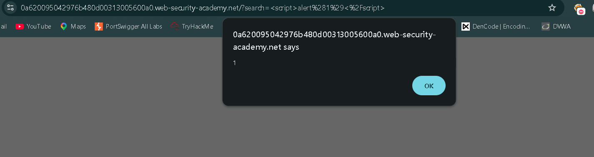

# 🔐 PortSwigger Lab - Reflected XSS into HTML Context with Nothing Encoded

## 🧠 Day 1 Learning

Today I learned how reflected XSS works when user input is inserted directly into HTML without encoding.

Key concepts learned:

* Direct reflection of user input
* HTML context injection
* JavaScript execution through browser parsing

---

## 🔍 Step 1: Understanding the Application Logic

The application provides a search functionality.

Whatever is entered in the search field is returned directly in the response page.

👉 User input is reflected inside HTML body content.

---

## ⚠️ Vulnerability

The application does not encode special characters such as:

```text
< > " '
```

Because of this:

Injected HTML tags are interpreted by the browser as executable code.

---

## 🧠 Exploitation Strategy

The goal is to inject JavaScript into the reflected search parameter.

Since input is placed directly into HTML body:

A basic script payload is enough.

---

## ⚔️ Step 2: Inject Payload

Entered the following payload into the search box:

```html
<script>alert(1)</script>
```

---

## 🔥 Why This Works

The browser receives:

```html
<script>alert(1)</script>
```

as part of page content.

Because no encoding is applied:

The browser executes the script immediately.

---

## ⚔️ Step 3: Trigger Execution

Clicked **Search**

The payload executed and alert box appeared.

---

## 🔍 Step 4: Analyze Result

Observed:

* JavaScript executed successfully
* Alert box displayed value **1**

---

## 🎯 Result

Lab solved successfully.

Payload used:

```html
<script>alert(1)</script>
```

---

## 📸 Screenshot



---

## 🏁 Final Result

Successfully:

* Exploited reflected XSS
* Executed JavaScript in browser
* Solved the lab

---

## 🧠 Key Learnings

* Reflected XSS occurs when input is returned without encoding
* HTML context allows direct script injection
* Browser executes injected script immediately

---

## 🔐 Vulnerability Type

* Reflected Cross-Site Scripting
* Improper Output Encoding

---

## 🛡️ Prevention

* Encode output before rendering user input
* Validate input
* Use Content Security Policy (CSP)

---

## 🔥 Real Insight

> Even very simple search functionality becomes dangerous
> when user input is returned without encoding.
s