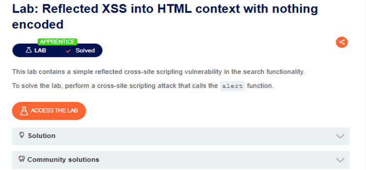
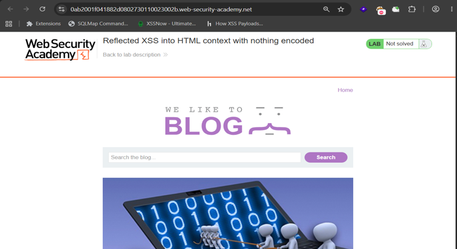
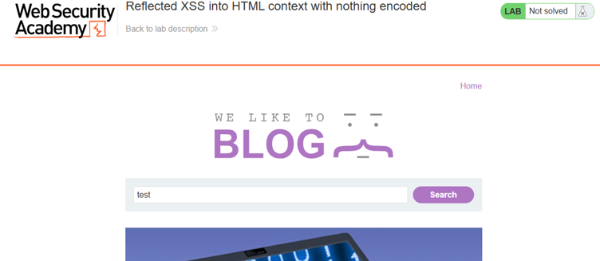
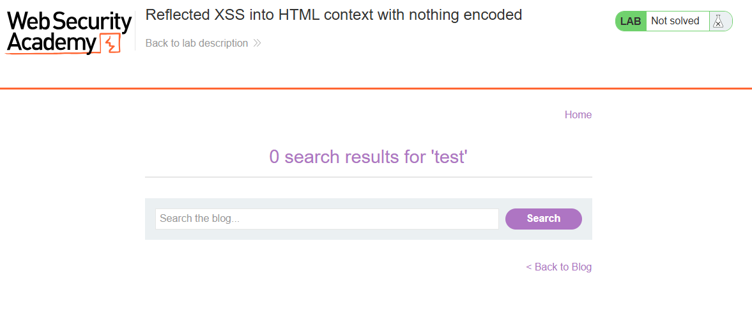
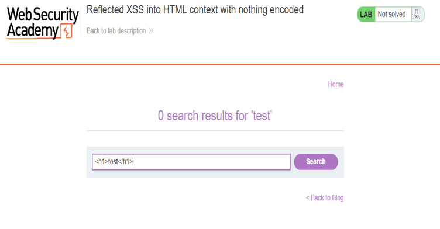
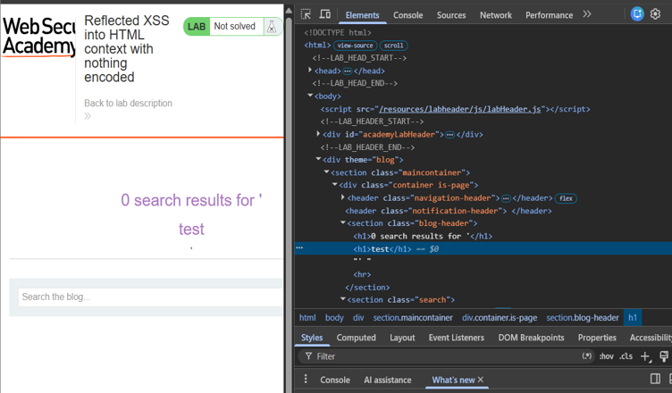
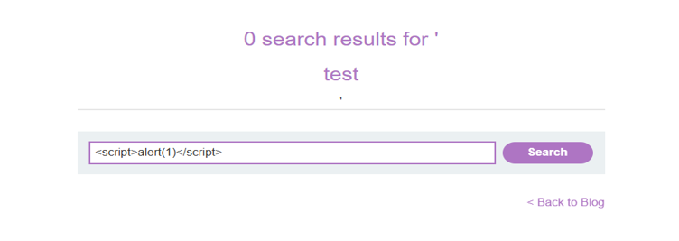
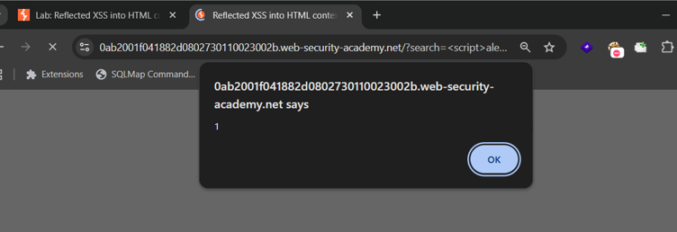

# 🔐 Lab 01: Reflected XSS into HTML Context with Nothing Encoded

## 📌 Lab Information

| Property | Details |
|---|---|
| **Platform** | PortSwigger Web Security Academy |
| **Difficulty** | Apprentice |
| **Vulnerability** | Reflected Cross-Site Scripting (XSS) |
| **Lab Name** | Reflected XSS into HTML context with nothing encoded |
| **Lab Status** | ✅ Solved |

---

# 🧪 Lab Overview

This lab contains a simple **Reflected Cross-Site Scripting (XSS)** vulnerability in the application's search functionality.

The objective of the lab was to identify how user-controlled input was handled and perform a cross-site scripting attack that calls the `alert()` function.

---

# 🧠 How I Approached the Problem

Instead of directly entering an XSS payload, I followed a step-by-step testing approach to understand how the application handled user-controlled input.

My approach was:

```text
Identify the input field
        ↓
Test normal text
        ↓
Check whether the input is reflected
        ↓
Test HTML input
        ↓
Inspect where the input appears
        ↓
Test JavaScript execution
        ↓
Confirm the vulnerability
```

---

# 📸 Screenshot 1: Understanding the Lab

The first screenshot shows the lab information provided by PortSwigger Web Security Academy.

The lab is titled:

**Reflected XSS into HTML context with nothing encoded**

The lab contains a reflected XSS vulnerability in the search functionality.

The objective was to perform a cross-site scripting attack that calls the `alert()` function.



---

# 📸 Screenshot 2: Identifying the Search Functionality

After accessing the lab, I explored the home page and identified the **search field**.

Since the search functionality accepts user-controlled input, I selected it as the first input point for testing.

At this stage, my main question was:

> Does the application reflect my search input back into the response?



---

# 📸 Screenshot 3: Testing Normal Input

To begin testing, I entered a normal text value:

```text
test
```

into the search field.

The purpose of this test was to check whether the application accepted my input and whether that input appeared anywhere in the application's response.



---

# 📸 Screenshot 4: Confirming Input Reflection

After submitting the search request, I observed that the text:

```text
test
```

was reflected and displayed on the page.

This confirmed that the application was taking my user-controlled input and reflecting it back in the response.

This was an important observation because reflected user input can become dangerous if it is inserted into the page without proper output encoding.



---

# 📸 Screenshot 5: Testing HTML Input

After confirming that normal input was reflected, I wanted to understand how the application handled HTML tags.

I entered the following HTML input into the search field:

```html
<h1>test</h1>
```

The purpose of this test was to determine whether the application treated my input as:

- Plain text
- Actual HTML

This step helped me investigate how the application handled special characters and HTML tags.



---

# 📸 Screenshot 6: Inspecting the HTML Source

After submitting the following input:

```html
<h1>test</h1>
```

the input was not displayed on the page in the same way as the normal text.

To understand what happened to my input, I inspected the page using the browser's developer tools.

While inspecting the HTML, I found my input:

```html
<h1>test</h1>
```

present in the page's HTML source.

This showed that the application was reflecting my user-controlled input into the HTML response.

At this point, I considered the possibility that if HTML input was being reflected without proper encoding, it might also be possible to inject executable JavaScript.



---

# 🔍 Different Possibilities I Considered

During the testing process, I considered the following questions:

- Is my input reflected back in the response?
- Where exactly is my input being reflected?
- Is the application treating my input as plain text or HTML?
- Are special characters such as `<` and `>` being encoded?
- Can HTML tags be injected into the reflected location?
- If HTML is interpreted, is JavaScript execution also possible?

My testing flow was:

```text
Normal Text
     ↓
Check Reflection
     ↓
HTML Input
     ↓
Inspect HTML Context
     ↓
JavaScript Payload
     ↓
Verify Execution
```

This approach helped me understand the application's behavior instead of immediately trying random payloads.

---

# 📸 Screenshot 7: Injecting the XSS Payload

After confirming that my HTML input was reflected in the page source, I tested whether JavaScript execution was possible.

I entered the following XSS payload into the search field:

```html
<script>alert(1)</script>
```

The purpose of this test was to determine whether the browser would interpret the injected `<script>` tag and execute the JavaScript code.



---

# 📸 Screenshot 8: Confirming the XSS Vulnerability

After submitting the payload, the injected JavaScript was successfully executed.

An alert popup appeared displaying:

```text
1
```

This confirmed that the application was vulnerable to **Reflected Cross-Site Scripting (XSS)**.

The browser interpreted the user-controlled input as executable code instead of treating it as plain text.

The successful execution of:

```javascript
alert(1)
```

confirmed the vulnerability and successfully solved the lab.



---

# ⚡ How the Vulnerability Was Confirmed

The vulnerability was confirmed by successfully executing the following payload:

```html
<script>alert(1)</script>
```

The application's search functionality reflected the payload into the HTML response.

Because the input was not properly encoded, the browser interpreted the `<script>` tag as executable code and executed:

```javascript
alert(1)
```

The alert popup displaying `1` confirmed successful JavaScript execution and proved the presence of a **Reflected XSS vulnerability**.

---

# 🎯 Root Cause

The vulnerability occurred because the application included **user-controlled input directly in the HTML response without properly encoding it**.

As a result, HTML tags and JavaScript supplied through the search functionality could be interpreted by the browser instead of being displayed as harmless text.

The vulnerable flow can be understood as:

```text
User Input
    ↓
Search Functionality
    ↓
Application Response
    ↓
Input Reflected Without Proper Encoding
    ↓
Browser Interprets Injected Code
    ↓
JavaScript Executes
```

---

# 🛡️ Remediation

To prevent this type of XSS vulnerability, the following security measures should be implemented.

## 1. Context-Aware Output Encoding

User-controlled data should be properly encoded before being inserted into an HTML response.

Special characters such as:

```text
< > " '
```

should be treated as text rather than executable HTML.

---

## 2. Treat User Input as Data

Untrusted input should never be directly inserted into HTML or JavaScript contexts without appropriate handling.

User-controlled data should always be treated as data, not executable code.

---

## 3. Use Secure Frameworks and Templating Systems

Modern frameworks and templating systems can automatically escape user-controlled content when used correctly.

This helps prevent browsers from interpreting user input as executable HTML or JavaScript.

---

## 4. Avoid Unsafe HTML Insertion

Developers should avoid directly inserting untrusted input into the page as HTML.

Unsafe handling of user-controlled data can allow attackers to inject HTML or JavaScript.

---

## 5. Input Validation

Input validation can help reduce unnecessary or unexpected input.

However, input validation should not be considered the only defense against XSS.

Proper output encoding is still required.

---

## 6. Content Security Policy

A properly configured **Content Security Policy (CSP)** can provide an additional layer of protection.

CSP can help reduce the impact of certain XSS vulnerabilities by restricting where scripts can be loaded or executed from.

> **The main remediation is to encode untrusted user-controlled output according to the context where it is displayed.**

---

# 📚 Key Learning

This lab taught me that identifying XSS is not only about memorizing a payload.

The important part is understanding:

> **How does the application process my input, and where is that input reflected?**

My learning process from this lab was:

```text
1. Identify an input point
        ↓
2. Test with normal text
        ↓
3. Check whether the input is reflected
        ↓
4. Test HTML input
        ↓
5. Inspect where the input appears
        ↓
6. Understand the HTML context
        ↓
7. Test whether JavaScript execution is possible
        ↓
8. Confirm the vulnerability
        ↓
9. Understand the root cause
        ↓
10. Recommend remediation
```

---

# 🎓 My Biggest Takeaway

> **Before testing an XSS payload, first understand where and how your input is reflected. The output context plays an important role in determining how an XSS vulnerability can occur.**

---

# 🏁 Conclusion

This lab demonstrated a basic **Reflected Cross-Site Scripting (XSS)** vulnerability in a search functionality.

By progressively testing:

```text
Normal Input
     ↓
HTML Input
     ↓
Inspecting the HTML
     ↓
XSS Payload
     ↓
Alert Popup
```

I was able to understand how user-controlled input was reflected into the application's response without proper encoding, ultimately allowing JavaScript execution.

This lab reinforced an important web security principle:

> **Never trust user-controlled input, and always apply context-appropriate output encoding before displaying it in a web page.**

---

# 🧠 Day 1 Learning Summary

Through this lab, I learned about:

- Direct reflection of user-controlled input
- Reflected Cross-Site Scripting (XSS)
- HTML context injection
- How browsers interpret injected HTML
- How JavaScript can execute when output is not properly encoded
- The importance of identifying the reflection context
- Context-aware output encoding
- Secure handling of untrusted input
- Basic XSS remediation techniques

---

# 🔐 Vulnerability Type

- **Reflected Cross-Site Scripting (XSS)**
- **Improper Output Encoding**
- **HTML Context Injection**

---

# ⚠️ Disclaimer

This lab was completed in the **PortSwigger Web Security Academy**, an intentionally vulnerable and authorized learning environment.

The techniques demonstrated in this repository are documented strictly for:

- Educational purposes
- Hands-on cybersecurity learning
- Authorized security testing

Do not use these techniques against systems without proper authorization.

## 👤 Author

**GURU CHANDRAYUDU**

*Cybersecurity Student | Aspiring Security Analyst*