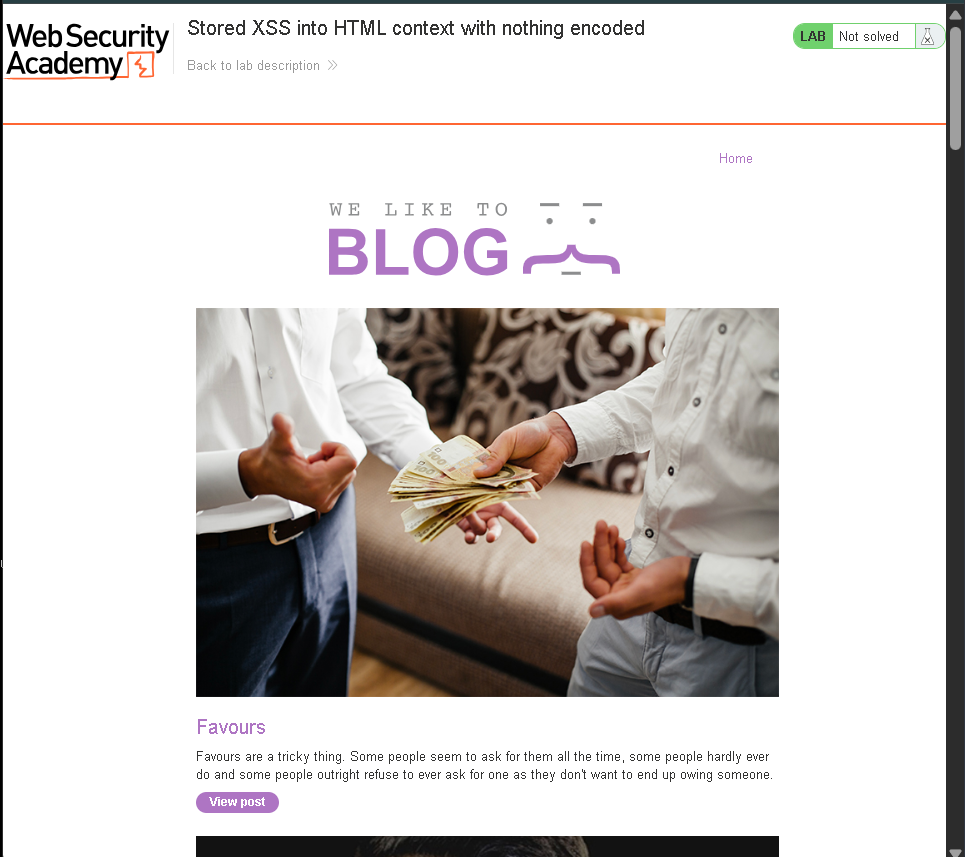
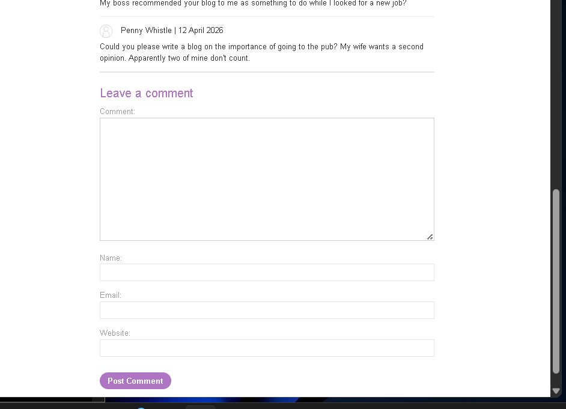
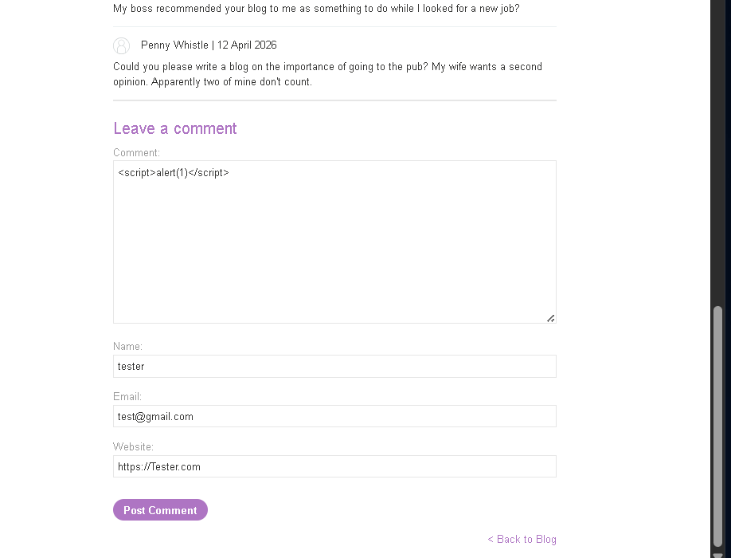
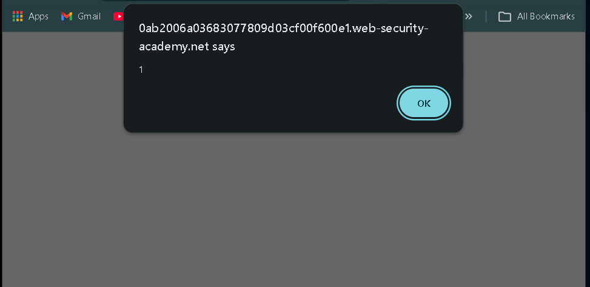
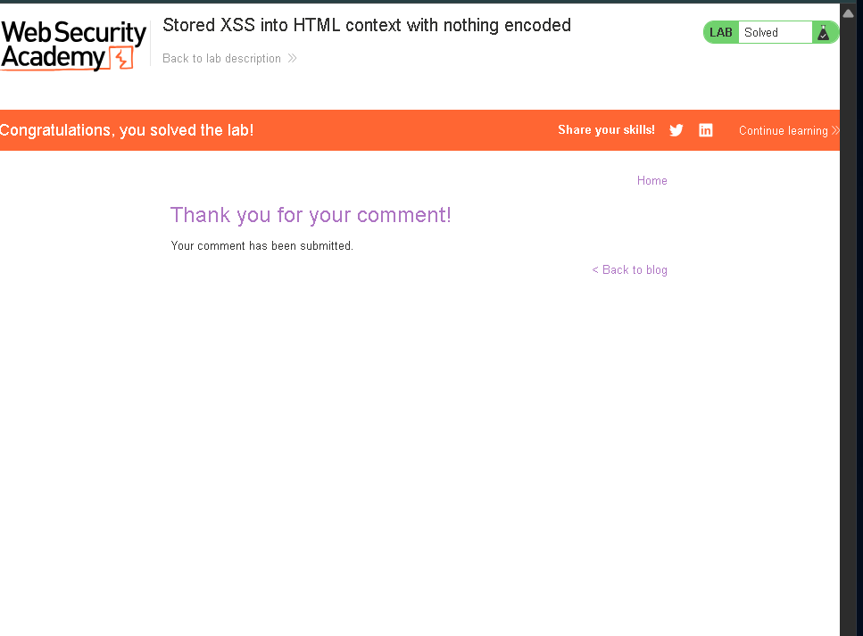

# 🔐 PortSwigger Lab - Stored XSS into HTML Context with Nothing Encoded

## 🧠 Day 2 Learning

Today I learned how stored cross-site scripting works when user input is saved by the application and later rendered without output encoding.

Key concepts learned:

* Persistent JavaScript injection
* Stored payload execution
* HTML context vulnerability

---

## 🔍 Step 1: Understanding the Application Logic

The application provides a blog comment feature.

Any comment submitted by a user is stored by the backend and displayed whenever the blog post is viewed.

👉 User input becomes persistent application content.

---

## 📸 Initial Application View



---

## ⚠️ Vulnerability

The comment field accepts special characters without encoding.

```text id="md601"
< > " '
```

Because of this:

Injected HTML tags are stored directly and interpreted by the browser.

---

## 📸 Vulnerable Comment Form



---

## 🧠 Exploitation Strategy

The goal is to inject JavaScript into the stored comment field.

Since input is rendered directly inside HTML body content:

A simple script payload executes when the page reloads.

---

## ⚔️ Step 2: Inject Payload

Entered the following payload:

```html id="md602"
<script>alert(1)</script>
```

Filled required fields:

```text id="md603"
Name: tester
Email: test@gmail.com
Website: https://tester.com
```

Clicked **Post Comment**

---

## 📸 Payload Submission



---

## 🔥 Why This Works

The application stores:

```html id="md604"
<script>alert(1)</script>
```

and later renders it directly into page content.

Because output encoding is missing:

The browser executes JavaScript automatically.

---

## ⚔️ Step 3: Trigger Stored Execution

Returned to the blog page.

The payload executed automatically.

---

## 📸 Alert Triggered



---

## 🎯 Result

Lab solved successfully.

Payload used:

```html id="md605"
<script>alert(1)</script>
```

---

## 📸 Lab Solved



---

## 🏁 Final Result

Successfully:

* Stored malicious payload
* Triggered JavaScript execution
* Exploited stored XSS
* Solved the lab

---

## 🧠 Key Learnings

* Stored XSS persists in backend storage
* Every future visitor may execute attacker payload
* Stored XSS is more dangerous than reflected XSS

---

## 🔐 Vulnerability Type

* Stored Cross-Site Scripting
* Improper Output Encoding

---

## 🛡️ Prevention

* Encode stored output before rendering
* Sanitize comment input
* Apply Content Security Policy (CSP)

---

## 🔥 Real Insight

> Stored XSS becomes dangerous because one payload can affect multiple users repeatedly.
