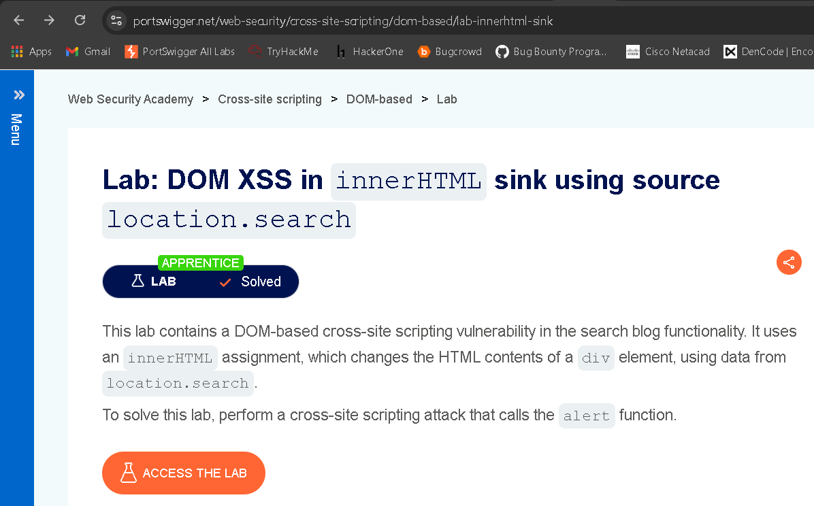
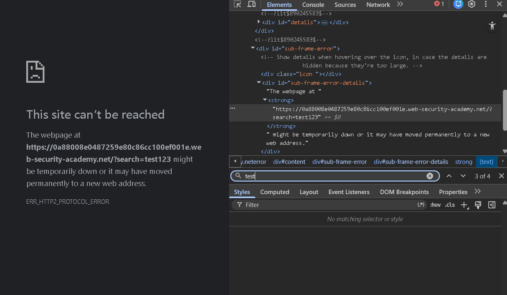
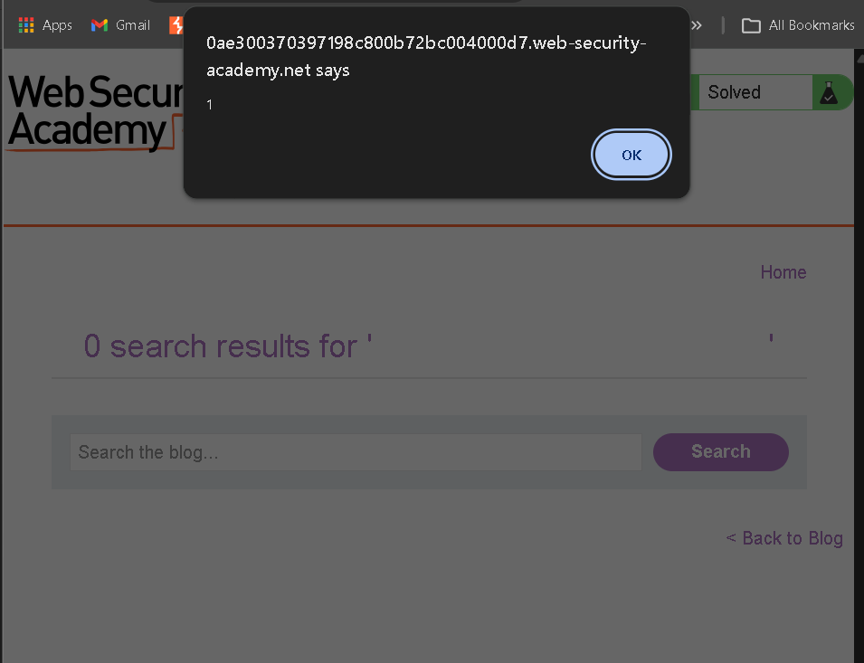

# 🔐 PortSwigger Lab - DOM XSS in innerHTML Sink Using Source location.search

## 🧠 Day 4 Learning

Today I learned how DOM-based XSS occurs when JavaScript reads attacker-controlled input from the URL and inserts it directly into the page using `innerHTML`.

Key concepts learned:

* Dangerous DOM sink behavior
* Browser HTML parsing behavior
* Event-handler based JavaScript execution

---

## 📸 Lab Description



---

## 🔍 Step 1: Understanding the Application Logic

The application contains a search functionality.

The search term from the URL is processed by JavaScript.

The page uses:

```javascript id="lab4final01"
innerHTML
```

to insert search input into page content.

👉 User input is taken directly from:

```javascript id="lab4final02"
location.search
```

---

## 📸 Initial Application View


---

## ⚔️ Step 2: Initial Testing

Entered random input:

```text id="lab4final03"
test123
```

Clicked **Search**.

Observed that the input was reflected directly into page content.

---

## 📸 Test Input Reflection


---

## ⚠️ Vulnerability

The application inserts URL-controlled data into HTML without sanitization.

Because of this:

Attacker input becomes executable DOM content.

---

## 🧠 Source and Sink

### Source

```javascript id="lab4final04"
location.search
```

### Sink

```javascript id="lab4final05"
innerHTML
```

---

## ⚔️ Step 3: Inspecting DOM Behavior

Inspected browser behavior and confirmed attacker input is parsed directly into the DOM.

---

## 📸 Inspecting Sink



---

## 🧠 Exploitation Strategy

Because input is parsed by `innerHTML`:

A malicious HTML element can be injected directly.

Instead of `<script>`, an event handler payload is more reliable.

---

## ⚔️ Step 4: Inject Payload

Used payload:

```html id="lab4final06"

```

---

## 📸 Payload Injection


---

## 🔥 Why This Works

The browser creates an image element:

```html id="lab4final07"

```

The source value is invalid:

```html id="lab4final08"
src=1
```

This causes image loading failure.

The browser triggers:

```html id="lab4final09"
onerror
```

Then executes:

```javascript id="lab4final10"
alert(1)
```

---

## ⚔️ Step 5: Trigger Execution

Loaded payload through search parameter.

The alert executed immediately.

---

## 📸 Alert Triggered



---

## 🎯 Result

Lab solved successfully.

Payload used:

```html id="lab4final11"

```

---

## 🏁 Final Result

Successfully:

* Exploited DOM XSS
* Identified source and sink
* Triggered event-based JavaScript execution
* Solved the lab

---

## 🧠 Key Learnings

* `innerHTML` parses attacker-controlled HTML directly
* Event handlers execute reliably in DOM XSS
* Payload choice depends on sink behavior

---

## 🔐 Vulnerability Type

* DOM-Based Cross-Site Scripting
* Unsafe DOM Manipulation

---

## 🛡️ Prevention

* Avoid unsafe sinks like `innerHTML`
* Use `textContent` for safe rendering
* Sanitize user-controlled DOM input

---

## 🔥 Real Insight

> `innerHTML` is one of the most dangerous DOM sinks because it converts attacker input directly into browser-parsed HTML.
